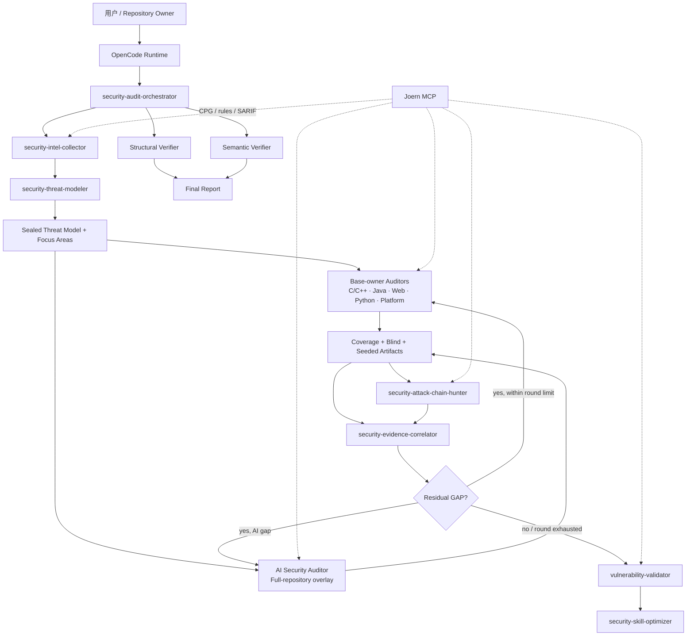
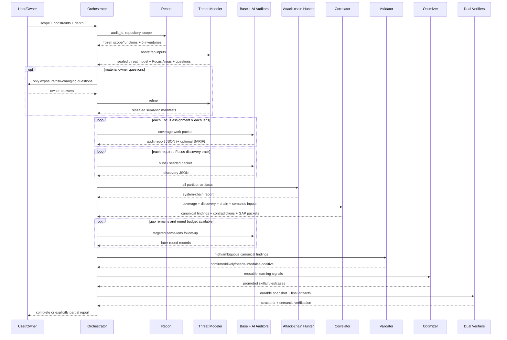

# DESIGN_NOW：OpenCode 多代理源码安全审计系统现状设计

> 文档类型：As-Is / Current Implementation Design
>
> 基线日期：2026-07-19
>
> 基线分支：`dev`
>
> 基线提交：`0c10da24159a7ef6819b6746e07a5a7bacb4eb75`
>
> 实现根目录：`.opencode/`
>
> 当前验证状态：在上述基线的 `.opencode/` 目录执行 `npm test`，配置、结构覆盖和语义覆盖测试全部通过。

本文描述当前仓库已经实现的系统，而不是未来蓝图。文中的“必须”分为两类：

- **机器强制**：由 JavaScript/Java 脚本、OpenCode 配置或 MCP 服务代码直接检查。
- **协议约束**：写在 agent/skill 提示词中，由 OpenCode 模型执行；若没有对应 verifier，则不应误解为确定性代码保证。

当 README、manifest、agent 提示词和可执行脚本不一致时，本文明确指出差异。覆盖是否完成最终以两个 verifier 的实际实现为准，而不是以自然语言或汇总计数为准。

---

## 1. 系统定位

### 1.1 系统是什么

本项目是一套放置在目标源码仓库根目录下的 **项目级 OpenCode 配置与审计知识包**。OpenCode 运行时读取 `.opencode/opencode.json`、`.opencode/agents/*.md` 和递归发现的 `.opencode/skills/**/SKILL.md`，由主 agent 编排多个安全审计 subagent。

系统覆盖：

- C/C++ 与 native 边界；
- Java/JVM 与服务端 Web；
- 浏览器 JavaScript/TypeScript、HTML、JSP/JSPX 和常见模板；
- Python 与常见 Web 框架；
- 依赖、构建、CI/CD、容器、编排、网关、网络和 IaC；
- LLM、Agent、RAG、Memory、MCP/Tool、模型供应链、训练、评测和模型制品；
- 跨 Focus Area、跨身份、跨租户、跨组件和跨部署层的系统攻击链。

系统不只是“让多个 agent 并行找漏洞”。它把审计拆成四种互相独立但可关联的证明活动：

1. **结构范围证明**：冻结所有文件，并用 AST/CPG 枚举可识别的函数/可执行模板单元。
2. **威胁语义证明**：入口点、威胁、资产、信任边界和 Focus Area 之间形成可追溯闭包。
3. **发现活动**：Tri-Lens coverage、Blind、Seeded Variant 和系统攻击链发现。
4. **双重验收**：结构 verifier 与语义 verifier 分别给出 `complete: true|false`。

### 1.2 系统不是什么

当前实现不是一个独立 Web 服务，也没有常驻的中心调度进程或数据库。除 Joern MCP 外，主要“控制逻辑”存在于 agent/skill 提示词中，由 OpenCode 会话驱动。

当前实现不提供以下保证：

- 不证明数学意义上的“仓库不存在任何漏洞”；
- 不覆盖仓库中不存在的运行时生成代码；
- 不证明远端模型、远端 MCP/Tool、云 IAM 或生产部署状态与仓库声明一致；
- 不自动攻击真实系统，也不授权外连利用、持久化、数据窃取或生产数据修改；
- 不以 grep 命中数代替 AST/CPG 函数全集；
- 不允许一个 finding 掩盖仍未审计的目标；
- 不把历史漏洞直接当作当前漏洞证据。

### 1.3 核心设计目标

| 目标 | 当前实现方式 | 确定性边界 |
|---|---|---|
| 全范围可追溯 | 递归文件系统冻结、文件哈希、稳定 ID、函数 manifest | 文件/函数范围由脚本确定 |
| 威胁驱动 | Recon → threat model → Focus Area | threat/focus schema 与语义 verifier 部分机器校验 |
| 多视角审计 | Sink / Control / Config 三个独立 session | 报告必须恰好包含一个 canonical lens |
| 防止抽样冒充全量 | 每个文件、函数、catalog 项逐条记账 | 结构 verifier 精确比较 ID 集合 |
| 防止基础审计遗漏 AI 风险 | base-owner + `domain=ai` 全仓第二覆盖层 | 每个文件/函数必须同时有 base 和 AI 记录 |
| 防止 checklist 锚定 | Blind 与 Seeded Variant 分轨 | 语义 verifier 校验 track artifact；内容质量主要是协议约束 |
| 跨模块发现 | 独立 system attack-chain pass | 必须精确覆盖 Focus Area、边界和资产 ID 集合 |
| 结果可学习 | validator → skill optimizer → skill/rule/case | 变更动作由 agent 执行，非自动规则学习引擎 |

---

## 2. 实现形态与事实来源

### 2.1 “配置即实现”

系统由以下六类实现共同组成：

| 实现层 | 位置 | 作用 |
|---|---|---|
| OpenCode 启动配置 | `.opencode/opencode.json` | 默认 agent、全局权限、MCP 注册与启停 |
| Agent 协议 | `.opencode/agents/*.md` | 角色、输入输出、阶段编排、工具和写权限 |
| Skill 协议与脚本 | `.opencode/skills/` | 审计方法、具体漏洞知识、覆盖构建与 verifier |
| 角色/资产 manifest | `.opencode/agent-manifest/` | 角色参考、skill/MCP 映射、产物和命名政策 |
| 共享知识资产 | `.opencode/shared/security-audit/` | 统一 catalog、Joern 规则、漏洞案例、误报案例 |
| 本地 MCP | `.opencode/mcp/joern-server.mjs` | CPG 创建、规则/查询执行、SARIF 导出和 session 清理 |

这里不存在一份单独的“工作流源代码”自动执行全部十个阶段。主编排 agent 读取协议后发起 subagent 调用，确定性脚本负责冻结、初始化、封存、快照和验收。

### 2.2 各领域的权威来源

| 领域 | 当前权威来源 | 说明 |
|---|---|---|
| OpenCode 默认行为/MCP 启停 | `.opencode/opencode.json` | README 只作说明 |
| Agent 实际 frontmatter | `.opencode/agents/*.md` | `roles.json` 是角色参考并由配置测试对齐 agent 名称 |
| Skill 实际存在性 | `skills/<group>/<skill>/SKILL.md` + `collection.json` | `skill-map.json` 不重复列 skill，仅映射 collection owner |
| 结构完成条件 | `verify-coverage.mjs` | `audit-coverage-accounting/SKILL.md` 是调用说明 |
| 语义完成条件 | `verify-semantic-coverage.mjs` | 与结构完成互不替代 |
| 产物路径/字段 | `artifact-policy.json`、初始化器和 verifier | 三者存在少量现状偏差，见第 20 节 |
| Threat/Focus 结构 | `references/artifact-schemas.md` + semantic verifier | 目前不是 JSON Schema 文件 |
| Joern 工具行为 | `joern-server.mjs` | `mcp-map.json` 只描述意图和 agent 分配 |
| Catalog 内容 | `application-ai-vulnerability-catalog.json` | 当前 profile 为 `application-ai-common-v3` |

### 2.3 当前仓库规模

| 项目 | 当前数量 |
|---|---:|
| Agent | 13（1 primary + 12 subagent） |
| Skill collection | 13 |
| 原子 Skill | 46 |
| 覆盖/封存/验收脚本 | 10 个 `.mjs` + 1 个 Java AST helper |
| 统一 catalog 条目 | 64 |
| 其中适用于 Java / Web / Platform / AI | 42 / 33 / 26 / 22（可重叠） |
| 已发布 Joern 规则 | 105 |
| 漏洞案例索引项 | 58 |
| 误报案例索引项 | 20 |

---

## 3. 总体架构



### 3.1 分层

1. **运行时接入层**：OpenCode 配置、agent frontmatter、skill 发现、MCP。
2. **控制层**：主编排 agent、`audit_id`、round、work packet 和门禁顺序。
3. **范围/语义规划层**：scope、functions、Recon inventory、threat model、Focus Areas。
4. **执行层**：语言/平台基础属主和 AI overlay；coverage/blind/seeded/system-chain 四类发现活动。
5. **证据层**：audit report、discovery、SARIF、attack-chain、correlation、validation。
6. **验收层**：durable snapshot、结构 verifier、语义 verifier。
7. **反馈层**：skill、Joern rule、vulnerability case、false-positive case 的增量维护。

### 3.2 中央化编排

所有 subagent 的 `task` 权限均为 `deny`。只有 primary agent `security-audit-orchestrator` 负责再分派任务，因此拓扑是严格的星型控制面，而不是 agent 任意递归生成 agent 的网状系统。

该限制的目的：

- 统一生成 `audit_id` 和 `agent_session_id`；
- 避免多个 agent 重复或冲突地分配同一 coverage key；
- 保证报告路径唯一；
- 由单一角色执行 gap round、双 verifier、最终报告和清理；
- 防止证据关联、验证和优化角色越界发起新的深度审计。

---

## 4. 核心概念与状态系统

### 4.1 `audit_id`

- 每次编排审计只分配一次，并贯穿 Recon、Threat、Focus、coverage、discovery、correlation、validation 和 verification。
- `artifact-policy.json` 和 scope builder 接受的格式为 `^[a-z0-9][a-z0-9._-]{2,127}$`（scope builder 实现为大小写不敏感）。
- 它是跨 session 聚合的根身份，不等于某个 agent session。

### 4.2 `agent_session_id`

每次 subagent 调用唯一。协议要求命名：

```text
<language-or-platform-or-ai>-<focus-area>-<sink|control|config>-coverage-r<round>
<language-or-platform-or-ai>-<focus-area>-<blind|seeded-variant>-r<round>
```

该 ID 参与报告文件名和 Joern session 目录名。策略要求唯一，但当前 verifier 主要通过报告内容、round 和 coverage key 判重，并不全局证明 session ID 从未复用。

### 4.3 D1-D10

| 维度 | 名称 | 主要问题 |
|---|---|---|
| D1 | Injection | 查询、命令、表达式、模板、响应上下文等注入 |
| D2 | Authentication | 密码、Token、Session、MFA、恢复和认证生命周期 |
| D3 | Authorization | 角色、租户、所有权、对象级/功能级授权和 CRUD 一致性 |
| D4 | Unsafe Data/Object Processing | 反序列化、解析、对象构造、native 内存和生命周期 |
| D5 | File Operations | 读写、上传、解压、路径、符号链接和执行 |
| D6 | SSRF / Network | 目的地、协议、DNS、重定向、代理和网络出口 |
| D7 | Cryptography | 算法、模式、密钥、随机数、证书、TLS 和轮换 |
| D8 | Configuration | Debug、CORS、日志、错误、Secret、暴露面和 hardening |
| D9 | Business Logic | 状态机、不变量、审批、批量、导出、并发、额度和幂等 |
| D10 | Supply Chain | 依赖、镜像、插件、仓库、签名、来源和构建输入 |

D1-D10 是统一规划维度，不是某个语言 agent 的排他漏洞分类。具体 agent 在同一维度下增加语言/平台/AI 特定锚点。

### 4.4 Tri-Lens

| Lens | 执行起点 | 必要证据 | 典型失败模式 |
|---|---|---|---|
| `sink-driven` | 安全敏感操作/anchor | source→transform→sink、可达性、攻击者影响、沿途 guard | 只搜危险 API，不证明调用和输入可控 |
| `control-driven` | 敏感操作/业务动作 | 应有控制、局部/全局/继承控制、缺失控制证据 | 只看注解，不枚举所有 CRUD/状态动作 |
| `config-driven` | 实际配置/依赖/部署选择 | 有效值、优先级、环境、baseline 和 consuming component | 把默认值或开发配置误当生产生效值 |

每个 coverage session **只能执行一个 lens**，但每个适用维度最终都必须有三个 lens。Lens 是任务模式，不是漏洞所有权；单个 finding 可以只源于一个 lens，其他 lens 可以提供支持证据或缓解证据。

### 4.5 四种发现轨道

| Track | 输入限制 | 输出 | 能否关闭结构/D1-D10 coverage |
|---|---|---|---|
| `coverage` | 完整 Focus assignment、单 lens、D1-D10、catalog | `*.audit-report.json` | **可以，是唯一可以关闭的轨道** |
| `blind` | 不加载历史根因、casebase 细节、弱点专项 checklist 或 prior finding | `*.discovery.json` | 不可以 |
| `seeded-variant` | 只加载映射到该 Focus 的历史 cluster、已验证 case、prior canonical finding | `*.discovery.json` | 不可以 |
| `system-chain` | 所有 Focus/track 结果、边界、资产和必要源码/配置 | attack-chain JSON | 不可以；只关闭系统链语义面 |

Seeded Variant 必须同时搜索：

- `same-pattern`：相同 API、guard、复制代码、兄弟调用点或配置路径；
- `same-class`：不同入口、数据形态、操作或绕过方式实现相同威胁结果。

### 4.6 四套状态枚举

| 对象 | 合法状态 | 闭合状态 | 说明 |
|---|---|---|---|
| D1-D10 coverage cell | `PASS` / `FINDING` / `GAP` / `N/A` | 除 `GAP` 外 | `PASS/FINDING` 要求 discovered=reviewed |
| file/function/catalog record | `REVIEWED` / `FINDING` / `GAP` / `N/A` | 除 `GAP` 外 | `FINDING` 必须引用同报告 finding ID |
| blind/seeded/system-chain | `PASS` / `FINDING` / `GAP` | `PASS` / `FINDING` | `PASS` 只表示该轨道执行完，不证明无未知漏洞 |
| entry-point decision | `THREAT` / `DEPRIORITIZED` / `GAP` | 前两者 | deprioritized 必须有理由和证据 |
| validation | `confirmed` / `likely` / `needs-info` / `false-positive` | 四者都是终态分类 | 不参与 coverage 关闭 |

关联聚合的状态优先级是：

```text
GAP > FINDING > PASS/REVIEWED > N/A
```

若一个 cell 已找到漏洞但仍有未审目标，cell 必须保持 `GAP`，finding 仍被保留。不能用“发现了问题”替代“完成了覆盖”。

### 4.7 Base 与 AI 双域

每个 reviewable 文件和每个已枚举函数都需要两份相互独立的覆盖：

- `domain=base`：由文件/函数的语言或平台 owner 负责；
- `domain=ai`：由 `ai-security-auditor` 对全仓再审一次。

AI overlay 即使 Recon 没发现任何明显 AI 依赖也不能省略。只有遍历完整 AI assignment 后，才能用带完整负面搜索证据的 `N/A` 关闭。Base 结论不得复制为 AI 结论，AI 结论也不替代 base owner。

---

## 5. OpenCode 运行时集成

### 5.1 启动配置

`.opencode/opencode.json` 当前关键值：

| 配置 | 当前值 | 含义 |
|---|---|---|
| `$schema` | `https://opencode.ai/config.json` | OpenCode 配置 schema |
| `default_agent` | `security-audit-orchestrator` | 默认进入主编排角色 |
| 全局 `permission["*"]` | `allow` | 未命中项自动允许 |
| 全局 `todowrite` | `deny` | 禁止该工具 |
| 全局 `bash` / `task` | `allow` | 全局默认允许；subagent frontmatter 再显式 `task: deny` |
| 全局 `skill["*"]` | `deny` | 全局基线拒绝；各 subagent frontmatter 使用 `skill: "*": allow`，主 agent 为 `permission: allow` |
| 全局 `joern_*` | `allow` | 本地 Joern MCP 默认可用 |
| 其他 MCP pattern | `deny` | 由 agent frontmatter 按角色放开；server 仍须实际启用 |

权限最终如何合并由 OpenCode 运行时决定；本仓库配置测试只验证“没有 `ask`”、全局 fallback 为 allow、orchestrator 为 `permission: allow`，并没有对每个工具做运行时权限集成测试。

### 5.2 MCP 注册状态

| Server | 类型 | `enabled` | 当前实现 |
|---|---|---:|---|
| `joern` | local | true | `node .opencode/mcp/joern-server.mjs` |
| `context7` | remote | false | URL 已配置，默认不连接 |
| `gh_grep` | remote | false | URL 已配置，默认不连接 |
| `semgrep` | placeholder | false | 无 type/command/url |
| `codeql` | placeholder | false | 无 type/command/url |
| `cpp_index` | placeholder | false | 无实际 server |
| `jvm_index` | placeholder | false | 无实际 server |
| `python_index` | placeholder | false | 无实际 server |
| `audit_lab` | placeholder | false | 无实际 server |

因此，frontmatter 中的 `semgrep_*: allow`、`codeql_*: allow` 或 `audit_lab_*: allow` 只代表角色许可，不代表当前仓库已经提供相应工具。

### 5.3 Node 依赖

`.opencode/package.json` 当前直接依赖：

- `@modelcontextprotocol/sdk ^1.29.0`
- `@opencode-ai/plugin 1.14.30`

测试和覆盖脚本使用原生 ESM `.mjs`。Joern MCP 从 `.opencode/node_modules` 直接导入 MCP SDK 和 Zod，因此部署时需要在 `.opencode/` 下安装 lockfile 对应依赖。

### 5.4 Joern 本地配置

当前配置面向 macOS/Homebrew：

```text
JOERN_BIN=/usr/local/bin/joern
JOERN_PARSE_BIN=/usr/local/bin/joern-parse
JOERN_VERSION=4.0.579
JOERN_GNUBIN=/opt/homebrew/opt/coreutils/libexec/gnubin
JOERN_JAVA_BIN=/opt/homebrew/opt/openjdk@21/bin
MCP timeout=300000 ms
Joern child-process timeout=180000 ms
```

这些路径可通过环境变量覆盖，但默认值不是跨平台的。

---

## 6. Agent 拓扑与职责

### 6.1 Agent 清单

| Agent | Mode / Temp | 核心职责 | 主要输入 | 主要输出 |
|---|---|---|---|---|
| `security-audit-orchestrator` | primary / 0.1 | 十阶段编排、coverage cube、gap round、双 verifier、报告和清理 | 用户 scope、约束、深度 | 最终报告、verification、artifact summary |
| `security-intel-collector` | subagent / 0.1 | 冻结 scope/functions，建立五层攻击面与五类 inventory | 仓库、audit ID | scope、function manifests、5 inventories、recon summary |
| `security-threat-modeler` | subagent / 0.1 | bootstrap/refine 威胁模型，分区 Focus Area | frozen Recon、历史、Owner 答案、catalog | sealed threat model、sealed Focus Areas |
| `c-cpp-source-auditor` | subagent / 0.1 | C/C++/native 单 Focus、单 track/lens 审计 | C/C++ assignment、CPG manifest | coverage/discovery、finding、SARIF |
| `java-source-auditor` | subagent / 0.1 | Java/JVM 单 Focus 审计并 progressive-load deep pack | Java assignment、catalog、function manifest | coverage/discovery、finding、SARIF |
| `web-source-auditor` | subagent / 0.1 | 浏览器 JS/TS 与模板审计 | JS + embedded-web manifests | coverage/discovery、finding、SARIF |
| `python-source-auditor` | subagent / 0.1 | Python/框架审计 | Python CPG manifest | coverage/discovery、finding、SARIF |
| `platform-security-auditor` | subagent / 0.1 | 依赖、构建、部署、CI/CD、容器、IaC | platform assignment、配置 inventory | coverage/discovery、effective-state gap |
| `ai-security-auditor` | subagent / 0.1 | 全仓 AI 第二覆盖层 | 全部 frozen IDs、AI inventory、AI catalog | `domain=ai` 精确 coverage/discovery |
| `security-attack-chain-hunter` | subagent / 0.2 | 独立跨 Focus/边界/资产攻击链发现 | 全部当前轮发现和源码/配置证据 | 每轮 attack-chain report |
| `security-evidence-correlator` | subagent / 0.1 | 无损归一化、去重、矛盾、gap packet、链 canonicalize | 所有报告与 sealed semantic inputs | correlation JSON |
| `vulnerability-validator` | subagent / 0.1 | 安全本地验证、可利用性分类、CVSS-like 估计 | canonical finding 与三类 evidence facet | 4 类 validation decision |
| `security-skill-optimizer` | subagent / 0.1 | 从验证反馈更新 skill/rule/case/FP | validation、existing assets | 可复用资产变更与优化摘要 |

### 6.2 硬角色边界

| 角色 | 明确不得承担的职责 |
|---|---|
| Orchestrator | 不直接深审语言代码；不直接验证 exploit；不直接改 reusable asset |
| Recon | 不给最终漏洞结论；不关闭 lens coverage |
| Threat modeler | 不发 point finding；不执行目标；不把历史 finding 当当前 finding |
| Source/Platform/AI auditors | 不在同一 session 混合多个 lens；不越过 primary scope；不改受审源码 |
| Correlator | 不做新的深审；不发明证据或攻击链 transition；不判 exploitability |
| Attack-chain hunter | 不验证 exploit；不把相关性文本冒充源码证据 |
| Validator | 不攻击第三方、不外泄、不持久化、不改生产数据 |
| Optimizer | 不改受审应用源码；不擅自改变 agent role boundary |

除部分写权限外，这些边界主要由提示词约束；详见第 18、20 节的机器执行边界。

### 6.3 工具和网络分配

| Agent 类别 | 外网 | 静态/CPG 工具意图 |
|---|---|---|
| Recon / Threat | webfetch、websearch 允许 | context7、gh_grep、Joern 允许；后两远程 server 默认关闭 |
| C/C++ | web 允许 | Semgrep、CodeQL、Joern、cpp_index 允许；仅 Joern 当前实现 |
| Java | web 允许 | Semgrep、CodeQL、Joern、jvm_index 允许；仅 Joern 当前实现 |
| Web | web 允许 | Semgrep、CodeQL、Joern 允许；仅 Joern 当前实现 |
| Python | web 允许 | Semgrep、CodeQL、Joern、python_index 允许；仅 Joern 当前实现 |
| Platform | web 允许 | context7、gh_grep 允许；默认都未启用 |
| AI | web 允许 | context7、gh_grep、Semgrep、CodeQL、Joern 允许；协议禁止发送 repo 内容到外部 AI 服务 |
| Correlator | web 禁止 | 所有 MCP 禁止 |
| Attack-chain | web 禁止 | 仅 Joern 允许 |
| Validator | web 允许 | Joern、audit_lab 允许；audit_lab 当前未实现 |
| Optimizer | web 允许 | 仅 Joern 允许 |

### 6.4 写权限现状

当前 frontmatter 的机器权限与“不得修改受审源码”的协议并不完全等价：

| Agent | `edit` 当前范围 |
|---|---|
| Orchestrator | `permission: allow`，未细分 |
| Threat modeler | 默认 deny，仅 `tmp/**` allow |
| AI auditor | 默认 deny，仅 `tmp/**`、`reports/**` allow |
| Attack-chain hunter | 默认 deny，仅 `tmp/**`、`reports/**` allow |
| C/C++、Java、Web、Python | `*` allow，`.opencode/shared/security-audit/**` deny |
| Recon、Platform、Correlator、Validator | `*` allow，`.opencode/shared/security-audit/**` deny |
| Optimizer | `*` allow，并列出 skill/shared/tmp 的 allow pattern；没有应用源码 deny |

因此，“source auditor 不修改受审源码”“optimizer 只改可复用资产”目前主要是协议约束，不是完整的文件系统最小权限强制。

---

## 7. Skill 体系

### 7.1 发现和映射

固定目录约定：

```text
.opencode/skills/<subagent-skill-group>/<skill-name>/SKILL.md
```

- group 目录本身不是 skill，不放 `SKILL.md`；
- 每个 group 的 `collection.json` 是该组唯一清单；
- `owner_agent` 表示维护/推荐属主；`common-subagent` 的 owner 是 `shared`；
- OpenCode 递归发现原子 skill；12 个 subagent frontmatter 显式允许 `skill: "*"`，primary orchestrator 使用整体 `permission: allow`；
- `validate-configuration.mjs` 检查 collection 中的名称与实际 `SKILL.md` 目录完全一致，并检查 frontmatter `name`。

这里的“auto-map”是项目维护约定和 owner 关系，并不是技能访问隔离。由于所有 agent 都允许任意被发现的 skill，真正限制某条轨道加载哪些 skill 的是 agent/skill 协议，例如 Blind 明确禁止加载弱点 pack。

### 7.2 Collection 清单

| Collection | Owner | Skill 数 | Skill |
|---|---|---:|---|
| `common-subagent` | shared | 4 | `secure-code-review-common`、`focus-area-vulnerability-discovery`、`audit-coverage-accounting`、`audit-artifact-management` |
| `security-intel-subagent` | Recon | 1 | `security-recon` |
| `threat-modeling-subagent` | Threat modeler | 1 | `evidence-backed-threat-modeling` |
| `c-cpp-subagent` | C/C++ auditor | 3 | memory safety、native boundary、file/privilege |
| `java-subagent` | Java auditor | 24 | 4 个 umbrella/thin review + 20 个弱点 deep pack |
| `web-subagent` | Web auditor | 1 | `web-source-security-review` |
| `python-subagent` | Python auditor | 4 | deserialization、execution、web framework、dependency/config |
| `platform-subagent` | Platform auditor | 1 | `platform-security-review` |
| `ai-subagent` | AI auditor | 1 | `ai-system-security-review` |
| `evidence-correlation-subagent` | Correlator | 1 | `tri-lens-evidence-correlation` |
| `attack-chain-subagent` | Attack-chain hunter | 1 | `system-attack-chain-hunting` |
| `vulnerability-validator-subagent` | Validator | 1 | `vulnerability-validation` |
| `security-skill-optimizer-subagent` | Optimizer | 3 | skill optimization、Joern maintenance、casebase maintenance |

### 7.3 Java progressive loading

Java auditor先加载 `java-web-comprehensive-review`，仅当攻击面、sink 或代码模式命中特定弱点时，再加载相应 deep pack：

| D# | 弱点 | Deep skill |
|---|---|---|
| D1 | SQL、NoSQL、LDAP、XPath、Command、SpEL、XSS、XXE | `java-sql-injection` 等 8 个 pack |
| D2 | JWT、CSRF | `java-jwt-misuse`、`java-csrf` |
| D3 | IDOR/BOLA | `java-idor` |
| D4 | Unsafe deserialization | `java-deserialization` |
| D5 | Path traversal、File upload | 两个对应 pack |
| D6 | SSRF、Open redirect | 两个对应 pack |
| D7 | Weak cryptography | `java-weak-cryptography` |
| D8 | Hardcoded secrets、Log injection | 两个对应 pack |
| D9 | Mass assignment | `java-mass-assignment` |

Deep pack 可含 `models/`、`rules/`、`analysis/`、`cases/`、`validation/` 和 `evidence/`。当前仓库 20 个 deep pack 均有防御性 validation YAML；SQL injection pack 额外含 references。

---

## 8. 端到端工作流



### 8.1 Phase 1 — RECON

Orchestrator 首先调用 `security-intel-collector`。Recon 必须先冻结结构，再做攻击面发现：

1. 构建递归文件系统 `scope-manifest.json`；
2. 无条件生成 Java、JavaScript、embedded-Web manifest，语言无文件时允许生成空但 complete 的 manifest；
3. 对 scope 中出现的其他 parser tag 生成 Python、C、C++、Kotlin 或 JVM manifest；
4. 任一 scope/function manifest 不完整时停止并报告 Recon GAP；
5. 生成五层 Attack Surface Map；
6. 生成五个标准化 inventory：entry point、sink、sensitive operation、config surface、AI surface；
7. 生成 D1-D10 applicability，状态为 `applicable`、有证据的 `not-applicable` 或 `unknown`。

Applicability 只用于规划，不能预先把任何 coverage cell 标成 `PASS` 或 `N/A`。

### 8.2 Phase 2 — THREAT MODEL

Threat modeler 有两种模式：

- `bootstrap`：从 frozen Recon、架构/安全文档、授权历史、advisory、prior finding 和 catalog 推导；
- `refine`：加入 Owner 答案，同时保留 code evidence、owner assertion、矛盾和部署未知。

每个入口点必须落到至少一个 durable threat，或一个有证据的 deprioritized decision。高风险 blocking question 未解决时保留 `GAP`。

### 8.3 Phase 3 — PLAN

Orchestrator 为以下笛卡尔积创建 coverage work packet：

```text
Focus Area × owner/domain assignment × audit_strategy(3)
```

同时：

- 每个 Focus Area 创建一个 Blind packet；
- Focus 映射到 history cluster 或 prior confirmed finding 时，再创建一个 Seeded Variant packet；
- 每个 coverage report 先初始化为全 `GAP`；
- 并发只允许写入互不相同的 artifact path/session ID。

### 8.4 Phase 4 — FOCUS-AREA DISCOVERY

Coverage session 必须输出 D1-D10 cell、exact file/function/catalog arrays、finding、gap、transfer block 和实际 review depth。若运行静态工具，还必须输出对应 session 的 SARIF。

Blind/Seeded session 只输出实际读取对象、hypothesis、seed provenance、证据、finding 和 gap；不能输出或修改 coverage accounting arrays。

### 8.5 Phase 5 — SYSTEM ATTACK-CHAIN PASS

在分区审计结束后执行一个新的系统级 pass。Hunter 逐个初始化并审查所有 Focus Area、trust boundary 和 asset，只有前一步 postcondition 满足下一步 precondition 时才连接 transition。

### 8.6 Phase 6 — CORRELATE

Correlator：

- 无损保留每条 coverage record；
- 按 fingerprint 去重 finding；
- 合并 sink/control/config evidence facet；
- 记录相互冲突的控制、配置、可达性或 scope 结论；
- 只 canonicalize hunter 已提供的 chain，不创建新 transition；
- 为每个结构/语义 gap 和高风险未知生成最小 follow-up packet。

### 8.7 Phase 7 — GAP ROUND

只重跑缺失 key、矛盾 cluster 和高风险 hotspot，不重复完整 key。轮数上限由协议规定：

| Depth | 最大轮数 |
|---|---:|
| quick | 1 |
| standard | 2 |
| deep | 3 |

达到轮数上限不会把 `GAP` 转成 `PASS`；最终只能输出带醒目 gap 的 partial report。

### 8.8 Phase 8 — VALIDATE

Critical/High、矛盾或依赖运行时可利用性的 canonical finding 被送到 Validator。Validator 分别保留：

- `sink_evidence`
- `control_evidence`
- `config_evidence`
- `mitigating_evidence`
- `contradictions`
- `residual_uncertainty`

并验证代码路径、输入可控性、实际可利用性和影响。

### 8.9 Phase 9 — OPTIMIZE

有可复用学习信号时，Optimizer 按 validation 状态更新 skill、Joern rule、vulnerability case、false-positive case 或 rule-results，并标注 threat、Focus、dimension、lens 和 discovery track。

### 8.10 Phase 10 — REPORT（禁止自动清理 tmp）

Orchestrator：

1. 读取所有 sealed semantic、coverage/discovery、chain、correlation、validation 和 SARIF；
2. 将 scope/functions/catalog/threat/focus 复制到 durable snapshot；
3. 执行结构 verifier；
4. 执行语义 verifier；
5. 按 verifier 结果把最终可读报告写到 `reports/final/security-audit-report.<audit_id>.md`（complete 或 partial）；
6. 在 reusable asset 完成提升后，**不**删除 `tmp/` 或 `tmp/<audit_id>/`；清理改为人工处理；
7. 永久保留 `reports/**` 全部交付件（但当前 `.gitignore` 默认不提交这些报告）。
8. 禁止把最终报告写到 `tmp/` 或被审计应用/测试源码树内部。

---

## 9. 冻结范围与函数清单实现

### 9.1 Scope builder

实现文件：

```text
.opencode/skills/common-subagent/audit-coverage-accounting/scripts/build-scope-manifest.mjs
```

命令契约：

```bash
node .opencode/skills/common-subagent/audit-coverage-accounting/scripts/build-scope-manifest.mjs \
  --root . \
  --audit-id <audit-id> \
  --output tmp/<audit-id>/recon/coverage/scope-manifest.json
```

算法顺序：

1. 解析参数并校验 `audit-id`；
2. 调用 `git -C <root> ls-files -z --cached`，只用于记录 `tracked_by_git`；
3. 使用 `opendir` 递归遍历真实文件系统，而不是只遍历 Git tracked file；
4. 每个目录按名称排序，每个文件最终按相对路径排序，确保稳定输出；
5. symlink 只记录 link target，不跟随；
6. regular file 读取前 8192 字节判断是否含 NUL，以此标记 binary；
7. regular file 计算完整 SHA-256；
8. 根据扩展名/文件名分类 owner、content kind 和 function parser；
9. 生成 `scope_digest`、summary、errors 和 `manifest_digest`；
10. 即使不完整也先写出 manifest，再以退出码 2 表示可诊断的不完整。

### 9.2 排除规则

实现排除项很窄：

| 路径 | 条件 | 原因 |
|---|---|---|
| 任意层级 `.git` | 目录名等于 `.git` | `version-control-internals` |
| 根级 `.opencode` | 仅 repository root 下 | `audit-infrastructure` |
| 根级 `reports` | 仅 repository root 下 | `audit-output` |
| 根级 `tmp` | 仅 repository root 下 | `audit-runtime-output` |

`node_modules`、`dist`、`build`、vendor 目录、未跟踪文件和被 `.gitignore` 忽略的文件不会自动排除。它们只要真实存在且不在上述四类中，就进入冻结 scope。所有排除都会写入 `exclusions`。

### 9.3 文件分类表

| 文件/扩展名 | Owner | `content_kind` | `function_parser` | inventory state |
|---|---|---|---|---|
| `.java` | Java auditor | source | `javac-java` | required |
| `.kt`, `.kts` | Java auditor | source | `joern-kotlin` | required |
| `.groovy`, `.scala` | Java auditor | source | null | **unsupported** |
| `.js`, `.jsx`, `.mjs`, `.cjs`, `.ts`, `.tsx` | Web auditor | source | `joern-js` | required |
| `.jsp`, `.jspx`, `.html`, `.htm`, `.ftl`, `.ftlh`, `.vm`, `.mustache`, `.hbs`, `.vue`, `.svelte` | Web auditor | template | `embedded-web` | required |
| `.css`, `.scss`, `.sass`, `.less` | Web auditor | web-resource | null | not-applicable |
| `.py`, `.pyw` | Python auditor | source | `joern-python` | required |
| `.c`, `.h` | C/C++ auditor | source | `joern-c` | required |
| `.cc`, `.cpp`, `.cxx`, `.hpp`, `.hh`, `.hxx` | C/C++ auditor | source | `joern-cpp` | required |
| `.gradle`、`Jenkinsfile` | Platform auditor | build-source | null | **unsupported** |
| `.sql` | Platform auditor | database-source | null | **unsupported** |
| XML/YAML/JSON/TOML/INI/conf/properties/env/Terraform/HCL | Platform auditor | configuration | null | not-applicable |
| Markdown/AsciiDoc/RST/TXT | Platform auditor | documentation | null | not-applicable |
| `Dockerfile`, `Makefile`, `Procfile`, `pom.xml` | Platform auditor | configuration | null | not-applicable |
| binary | Platform auditor | binary | null | not-applicable |
| symlink | Platform auditor | symlink | null | not-applicable |
| 其他非 binary 文件 | Platform auditor | unknown-text | null | **unsupported** |

无论 function inventory 是否适用，当前所有发现的文件和 symlink 都设置：

```json
{
  "review_required": true,
  "required_lenses": ["sink-driven", "control-driven", "config-driven"]
}
```

任何 `function_inventory_state=unsupported` 都会被初始化器拒绝，并被结构 verifier 记为 `UNSUPPORTED_FUNCTION_INVENTORY`。这是刻意的 fail-closed 设计：潜在函数型源码没有 AST/CPG extractor 时，审计不能声称结构完整。

### 9.4 ID 与 digest

#### File ID

```text
file_id = "file:" + first_24_hex(SHA256(normalized_relative_path))
```

因此：

- 内容修改不改变 file ID，但改变文件 SHA 和 scope digest；
- 文件重命名/移动会改变 file ID；
- Windows 分隔符被规范化为 `/`。

#### Scope digest

对按路径排序的所有 record 连接：

```text
path NUL type NUL (sha256 OR link_target)
```

再计算 SHA-256。它绑定路径、entry 类型和内容/link target，不直接绑定 owner/parser policy。Owner/parser/lens 等完整对象变化由 `manifest_digest` 和 verifier 的 `SCOPE_POLICY_DRIFT` 额外检测。

#### Manifest digest

所有 manifest 使用同一基本方法：

1. 删除顶层 `manifest_digest`；
2. `JSON.stringify` 剩余对象；
3. 计算 SHA-256。

这不是签名或 MAC，只是完整性/漂移检测；能修改 artifact 和 digest 的主体仍可重封存。

### 9.5 Java AST manifest

实现：

```text
build-java-function-manifest.mjs
JavaFunctionInventory.java
```

提取器使用 JDK compiler API：`JavacTask.parse()` + `TreePathScanner`，参数为 `-proc:none -Xlint:none`。它只解析 scope 中 `function_parser=javac-java` 的文件，并枚举：

- method；
- constructor；
- lambda；
- static initializer；
- instance initializer。

每个函数记录：

- path、kind、name、qualified name、signature；
- start/end line、start column；
- 对函数源码片段计算的 `code_sha256`；
- owner=`java-source-auditor`；
- required lenses。

Java function ID：

```text
function: + first_32_hex(SHA256(
  "java|path|kind|qualified_name|signature|line_start"
))
```

line start 参与身份，因此在函数上方插入代码可能改变 function ID。任何 Javac `ERROR` diagnostic、缺失文件或意外文件都会使 manifest `complete=false`，脚本写出诊断后返回退出码 2。

### 9.6 Joern function manifest

实现：`build-joern-function-manifest.mjs`。

支持参数语言与 Joern frontend 映射：

| 参数 | Joern frontend | Scope parser tag | Owner |
|---|---|---|---|
| `javascript` | javascript | `joern-js` | Web |
| `python` | python | `joern-python` | Python |
| `c` | c | `joern-c` | C/C++ |
| `cpp` | c | `joern-cpp` | C/C++ |
| `kotlin` | kotlin | `joern-kotlin` | Java |
| `jvm` | java | `joern-jvm` | Java |

脚本对 `--root` 执行一次 `joern-parse`，检查输出 CPG 存在、非空且日志不含已知异常标记，再执行临时 Scala query 导出：

- CPG 中所有 file name；
- 所有非 external method；
- method full name、signature、line、code。

最终只保留 path 属于当前 parser 的 expected file 的函数。`unexpected_cpg_files` 会进入 manifest summary，但当前 `complete` 只由 `missing_files.length === 0` 决定。

函数 ID 与 Java 类似，identity 中语言、path、kind、qualified name、signature 和 line start 参与哈希；`code` 被替换成 `code_sha256`，不在 manifest 保留函数全文。

### 9.7 Embedded-Web manifest

实现：`build-embedded-web-manifest.mjs`。它组合模板块识别和 Joern JS 提取：

1. 逐个 UTF-8 读取 template 文件；
2. 识别没有 `src` 的可执行 `<script>` block；
3. 为 inline script 生成保留原起始行偏移的 synthetic `.js/.ts` 文件；
4. 对 synthetic root 递归调用 scope builder 和 Joern JavaScript builder；
5. 将提取结果映射回原 template path；
6. 额外直接枚举模板/HTML/JSP 可执行单元。

直接枚举的单元包括：

- FreeMarker macro/function；
- Velocity macro；
- HTML `on*` event handler；
- Vue/类似框架 event expression；
- `javascript:` URL handler；
- JSP declaration、service block 和 expression block；
- 非 JavaScript 的非空 script block（作为独立审计单元）。

任一模板读取失败、synthetic mapping 丢失或缺少 expected file 都使 manifest 不完整。

### 9.8 函数 manifest 的全局闭合条件

结构 verifier 要求：

- 每个 `function_inventory_required` 文件恰好出现在一个 manifest 的 `expected_files`；
- manifest language 与 scope parser tag 精确匹配；
- manifest audit ID、scope digest 和 manifest digest 正确；
- `complete=true`、无 missing file、无 diagnostic；
- function ID 全局唯一；
- function path、owner、required lenses 与 scope file 一致；
- function 有非空 qualified name、合法 line start 和 64 位 `code_sha256`；
- manifest 不包含 scope 未要求函数 inventory 的文件。

---

## 10. Recon、Threat Model 与 Focus Area 数据模型

### 10.1 五层攻击面

| 层 | 内容 |
|---|---|
| T1 Architecture | 组件、协议、边界、部署单元 |
| T2 Business | 关键资产、工作流、角色、租户、不变量 |
| T3 Framework/Language | 语言、框架、parser、client、安全中间件 |
| T4 Deployment | 容器、CI/CD、编排、IaC、网络暴露 |
| T5 Functions | Route、RPC、CLI、job、consumer、敏感操作 |

不存在证据的层必须进入 gap，不能由模型补写虚构架构。

### 10.2 五类 Recon inventory

每个文件都要求 `schema_version`、`audit_id`、`scope`、`items`、`gaps`、`tool_inputs`；即使没有任何 item 也必须输出空数组 artifact。

| Inventory | 必要内容 |
|---|---|
| Entry Point | HTTP/RPC/CLI/message/scheduler/hook/upload/import/config input；暴露、认证、输入、下游、边界 |
| Sink | execution/query/template/parser/file/network/redirect/crypto/output/state/dependency/build sink；guard、reachability |
| Sensitive Operation | auth lifecycle、CRUD、admin/tenant、payment/approval/export/batch/state/secret/release/provenance；应有控制和 CRUD group |
| Config Surface | application/dependency/build/CI/container/orchestration/gateway/IaC/override；值、优先级、baseline、consumer |
| AI Surface | provider/model/prompt/context/agent/tool/MCP/RAG/vector/memory/approval/inter-agent/config/training/eval/artifact/observability/lifecycle |

发现 secret 时只保留首尾四字符；AI inventory 还必须记录 approval binding、replay/idempotency、message integrity/freshness、circuit breaker 和 release-gate 证据（适用时）。

### 10.3 Threat model schema

规范路径：`tmp/<audit_id>/recon/threat-model.json`。

| 字段 | 语义 | 关键约束 |
|---|---|---|
| `schema_version` | 当前为 1 | seal script 只接受 1 |
| `audit_id`, `scope_digest` | 绑定 frozen scope | 必须与 snapshot 一致 |
| `mode` | bootstrap 或 bootstrap-then-interview | 当前 verifier 不枚举检查 mode |
| `assets[]` | `ASSET-*` | ID 唯一；attack-chain 必须全部 review |
| `actors[]` | `ACTOR-*` | threat 至少引用一个已知 actor |
| `trust_boundaries[]` | `TB-*` | entry/threat/focus 引用必须存在 |
| `entry_points[]` | `EP-*` | 必须有 evidence、边界和 reachable asset 引用 |
| `threats[]` | `T-*` | outcome 至少 12 字符；actor/entry/asset 非空；dimension 合法；provenance 非空 |
| `deprioritized[]` | 明确不优先的 threat class | reason/evidence 通过 entry coverage 表达 |
| `history_clusters[]` | 历史根因的泛化 cluster | 触发 Focus 的 Seeded Variant |
| `entry_point_coverage[]` | THREAT/DEPRIORITIZED/GAP | 每个 entry 恰好一个 terminal record |
| `open_questions[]` | Owner/部署未知 | blocking=true 且未 resolved 会阻塞语义完成 |
| `provenance` | target、commit、input、owner | 分离来源 |
| `manifest_digest` | 内容 digest | seal 后写入 |

合法 provenance tag 的协议集合：

```text
code-verified
documented
owner-asserted
history-inferred
deployment-unknown
contradictory
```

历史证据按 `entry_point × weakness_class × asset` 聚类，最终 threat 应描述长期有效的安全结果，而不是“某行存在某 bug”。

### 10.4 Focus Area schema

规范路径：`tmp/<audit_id>/recon/focus-areas.json`。

每个 Focus Area 由业务/攻击路径语义而不是纯目录边界组成，可围绕入口、协议/格式、工作流、身份/租户、信任边界、资产、部署 transition 或 AI tool/RAG/memory chain。

| 字段 | 语义 |
|---|---|
| `focus_area_id` | 稳定 `FA-*` 身份 |
| title/description/priority | 人类可读范围和优先级 |
| `entry_point_ids` | 该区域覆盖的入口 |
| `threat_ids` | 该区域负责的 durable threat |
| `trust_boundary_ids` | 相关边界 |
| `asset_ids` | 相关资产 |
| `history_cluster_ids` | 映射历史 cluster；非空时必须要求 seeded track |
| `required_discovery_tracks` | 至少 `coverage` 和 `blind`；条件满足时含 `seeded-variant` |
| `assignments[]` | primary 结构记账分区 |
| `context_file_ids/function_ids` | 可重叠阅读上下文，不关闭 coverage |

Assignment 结构：

```json
{
  "assignment_id": "FA-001-java-base",
  "agent_name": "java-source-auditor",
  "language": "java",
  "file_function_domain": "base",
  "catalog_domain": "java",
  "file_ids": [],
  "function_ids": [],
  "catalog_ids": []
}
```

一个 assignment 的三个 ID 数组不能全空。对相同 `agent_name + entity domain + entity kind`，primary entity 不能跨 Focus 重复。所有 frozen structural entity 必须有且只有一个 primary assignment；无法自然映射的实体进入 residual Focus Area，而不是留空。

### 10.5 Sealing 顺序

实现脚本：`seal-semantic-manifest.mjs`。

正确顺序：

1. 生成 threat model；
2. seal threat model，得到 `threatModel.manifest_digest`；
3. 将该 digest 写入 Focus manifest 的 `threat_model_digest`；
4. seal Focus manifest；
5. 后续初始化器和 snapshot 同时验证 scope digest、两个 manifest digest 和 threat→focus digest 链。

Seal 只检查 artifact 大类和基础身份格式，不执行 semantic verifier 的所有引用闭合检查。因此“已 seal”不等于“语义有效”。

---

## 11. Work Packet 与审计报告

### 11.1 Coverage work packet

公共协议要求字段：

```yaml
audit_id: <stable-id>
agent_session_id: <unique-session-id>
round: <positive-integer>
threat_model: <sealed-path>
focus_areas: <sealed-path>
focus_area_id: <FA-id>
discovery_track: coverage
entry_point_ids: []
threat_ids: []
trust_boundary_ids: []
asset_ids: []
scope_manifest: <path>
scope_digest: <sha256>
assigned_file_ids: []
function_manifests: []
assigned_function_ids: []
catalog_profile: <profile-id>
catalog_domain: <java|web|platform|ai|null>
assigned_catalog_ids: []
language: <c-cpp|java|web|python|platform|ai>
audit_strategy: <sink-driven|control-driven|config-driven>
dimensions: [D1, D2, D3, D4, D5, D6, D7, D8, D9, D10]
inventory_refs:
  entry_points: <path>
  sinks: <path>
  sensitive_operations: <path>
  config_surfaces: <path>
previous_gaps: []
depth: <quick|standard|deep>
```

AI packet 额外要求 `ai-surfaces.json`。缺少 sealed semantic input、Focus ID、exact primary assignment 或唯一 lens 时，agent 协议要求返回 protocol `GAP`。

### 11.2 初始化器

实现：`initialize-audit-report.mjs`。

初始化器先验证：

- scope complete、digest 正确且没有 unsupported potential function source；
- threat/focus 已 seal、audit/scope/digest 链一致；
- required lenses 至少包含 canonical 三项；
- 所有 required function file 恰好属于一个 complete manifest；
- AI agent 提供 scope-matched AI inventory；
- Focus 对当前 agent 恰好有一个 assignment；
- assignment language、file/function domain 和 catalog domain 与 agent 匹配；
- 指定的 file/function/catalog ID 由当前 agent/domain 拥有。

随后它生成所有 D1-D10 cell 和所有 assignment record，初态全部为 `GAP`。Auditor 只能在原数组中逐条关闭，禁止重建更短数组。

### 11.3 Coverage report schema

规范路径：

```text
reports/vulnerability-mining/<agent_name>.<agent_session_id>.audit-report.json
```

核心字段：

| 字段 | 约束 |
|---|---|
| `schema_version` | 当前 1 |
| `audit_id`, `round`, `agent_name`, `agent_session_id` | session 身份 |
| `scope_digest` / `scope.scope_digest` | frozen scope |
| `focus_area_id` | 单一 Focus |
| `discovery_track` | 必须为 `coverage` |
| `language` | 必须与 agent 固定映射一致 |
| `audit_strategy` | 三个 canonical lens 之一且只有一个 |
| `dimensions` | D1-D10 精确集合 |
| `tool_inputs` | 至少一项；AI 必须含匹配 digest 的 ai-surfaces input |
| `coverage_cells` | 恰好 10 项，每项 lens 等于 audit strategy |
| `review_depth` | 实际 file/function/path/search；只作 anomaly signal |
| `file_coverage` | 与 `scope.assigned_file_ids` 精确相等 |
| `function_coverage` | 与 assigned function IDs 精确相等 |
| `catalog_coverage` | 与 assigned catalog IDs 精确相等 |
| `findings` | finding ID 在报告内唯一 |
| `artifacts`, `learning_candidates` | 必须为数组 |

Coverage cell 示例：

```json
{
  "dimension": "D3",
  "lens": "control-driven",
  "status": "PASS",
  "targets_discovered": 12,
  "targets_reviewed": 12,
  "evidence": [{"path": "src/...", "operation": "..."}],
  "finding_ids": [],
  "gap_reason": null,
  "na_reason": null
}
```

Entity record 示例：

```json
{
  "function_id": "function:<stable-id>",
  "domain": "base",
  "status": "REVIEWED",
  "dimensions_reviewed": ["D1", "D2", "D3", "D4", "D5", "D6", "D7", "D8", "D9", "D10"],
  "evidence": [{"path": "src/...", "qualified_name": "Example.method"}],
  "finding_ids": []
}
```

Catalog record 的 `dimensions_reviewed` 必须精确等于该 catalog entry 声明的维度，而不是固定 D1-D10。

### 11.4 Discovery report schema

规范路径：

```text
reports/vulnerability-mining/<agent_name>.<agent_session_id>.discovery.json
```

```json
{
  "schema_version": 1,
  "audit_id": "audit-id",
  "round": 1,
  "agent_name": "...",
  "agent_session_id": "...",
  "scope_digest": "sha256",
  "focus_area_id": "FA-001",
  "discovery_track": "blind|seeded-variant",
  "entry_point_ids": [],
  "threat_ids": [],
  "files_read": [],
  "functions_read": [],
  "hypotheses_tested": [],
  "seed_inputs": [],
  "status": "PASS|FINDING|GAP",
  "evidence": [],
  "findings": [],
  "gaps": []
}
```

Blind 的 `seed_inputs` 必须为空；Seeded Variant 必须非空。语义 verifier 要求至少一个 hypothesis、非空 evidence、空 gaps 和 closed status。

### 11.5 Finding evidence contract

每个 candidate 协议上必须包含：

1. 真实 `file:line` 或配置位置；
2. dimension、origin lens、Focus、threat IDs 和 discovery track；
3. 相关的 sink/control/config evidence facet；
4. reachability、attacker influence、guards、provenance、residual uncertainty；
5. `Reachability × InputControl × ExploitComplexity × Impact` 严重度理由；
6. 可操作 remediation。

结构 verifier 当前只机器检查 finding ID 唯一、被 `FINDING` record/cell 正确引用；上述丰富字段主要由 common skill、correlator 和 validator 协议保证。

---

## 12. Coverage Cube 与双 verifier

### 12.1 结构 coverage key

结构 verifier 保存并验证以下不聚合 key：

```text
file_id     | domain(base|ai) | lens
function_id | domain(base|ai) | lens
catalog_id  | domain          | lens
```

Correlation artifact 额外保留 `round` 和 `owner_agent`。Verifier 对同一 key 选择最高 round 的唯一 record；最高 round 存在多个 record 时产生 `AMBIGUOUS_LATEST_COVERAGE`。

设：

- `F` = `review_required=true` 的 frozen file 数；
- `H` = 所有 complete function manifests 的 function 数；
- `C` = catalog entry 与 active applicable domain 的 pair 数；
- lens 数固定为 3；
- file/function domain 固定为 base 与 AI 两个。

则结构记录期望总量为：

```text
files     = F × 2 × 3
functions = H × 2 × 3
catalog   = C × 3
total     = 6F + 6H + 3C
```

Catalog active domain 的实现规则：

- `ai` 永远 active；
- 如果 frozen file owner 中出现 Java/Web/Platform agent，则对应 domain active；
- C/C++ 和 Python 当前不是统一 catalog 的 domain；
- 一个 catalog entry 对每个 active 且 `applies_to` 命中的 domain 独立审计。

### 12.2 语义 coverage key

语义层主要验证：

```text
entry_point_id → THREAT or DEPRIORITIZED
threat_id → at least one Focus Area
primary structural entity → exactly one Focus assignment
Focus assignment × lens → one complete exact-assignment coverage session
Focus Area × required blind/seeded track → valid discovery artifact
Focus Area / trust boundary / asset → exact system-chain reviewed ID set
```

设 Focus assignment 数为 `A`，则精确 lens session 期望为 `A × 3`。Primary assignment entity key 数为：

```text
P = 2F + 2H + C
```

即每个 file/function 各有 base 与 AI primary assignment，每个 active catalog-domain pair 有一个 primary assignment。

### 12.3 Structural verifier 输入

实现：`verify-coverage.mjs`。

必要参数：

```text
--root
--audit-id
--scope
--snapshot-index
--functions <repeatable>
--reports-dir
--catalog
--output
```

最终验证应使用 `reports/coverage/<audit_id>/inputs/` 中的 durable copies，而不是仅依赖 `tmp` 中的中间文件（`tmp` 默认保留、人工清理，但仍不是最终交付位置）。

### 12.4 Structural verifier 执行顺序

1. 校验 snapshot index 的 audit ID、scope digest 和 snapshot digest；
2. 要求 CLI 提供的 scope/catalog/function path 集合精确等于 snapshot；
3. 校验 snapshot 中每个文件的 byte SHA-256；
4. 校验 frozen scope 的 audit ID、manifest digest、complete、errors 和 canonical lens 集合；
5. 在系统临时目录重新运行 scope builder；
6. 比较 current 与 frozen scope digest，输出 added/removed/changed；
7. 比较 owner/parser/lens policy，检测 `SCOPE_POLICY_DRIFT`；
8. 校验每个 scope record 的 owner、parser state/reason 和 unsupported 状态；
9. 校验所有 function manifest、membership、function shape 和 parser 对应；
10. 校验 catalog ID、title、domain、dimension 和三类 lens question；
11. 递归读取 reports 目录下所有 `*.audit-report.json`，忽略其他 audit ID；
12. 校验 report identity、单 lens、D1-D10、tool input、assignment arrays 和 coverage arrays；
13. 校验每个 cell/record 的状态、evidence、dimension、count、N/A reason 和 finding reference；
14. 将 record 放入 file/function/catalog key map；
15. 对每个 expected key 选择唯一 latest round；
16. 输出 missing、invalid、issues、current scope digest 和 claim boundary。

### 12.5 Structural record 的硬校验

Entity record：

- evidence 必须是非空数组，且每项为非空 string 或非空 object；
- `dimensions_reviewed` 必须是精确集合，无重复；
- `N/A` 的 `na_reason` 至少 8 字符；
- `FINDING` 至少一个 finding ID，且都在本报告 `findings`；
- `GAP` 一律不闭合；
- domain 与 report agent 必须匹配；
- file/function/catalog ID 必须存在且属于正确 owner/domain。

D1-D10 cell：

- 恰好 10 个且 dimension 不重复；
- cell lens 等于 report lens；
- evidence 非空；
- `PASS/FINDING` 的 `targets_discovered` 必须是非负整数，`targets_reviewed === targets_discovered`；
- `N/A` 理由至少 8 字符；
- `FINDING` 正确引用本报告 finding；
- `GAP` 阻塞完成。

### 12.6 Structural complete

只有以下表达式为真时：

```text
issues.length == 0
AND all missing arrays empty
AND all invalid arrays empty
```

输出才是 `complete: true`。脚本退出码：

- `0`：complete；
- `2`：成功执行但 coverage 不完整/无效；
- `1`：参数、I/O 或未捕获运行错误。

### 12.7 Semantic verifier 输入与执行顺序

实现：`verify-semantic-coverage.mjs`。

必要参数：

```text
--audit-id
--snapshot-index
--reports-dir
--attack-chain-report
--output
```

执行顺序：

1. 校验 snapshot digest，并要求 snapshot 包含 threat/focus 路径；
2. 校验 semantic snapshot byte hashes 和两个 manifest digest 链；
3. 从 snapshot scope/functions/catalog 计算完整 primary universe；
4. 建立 asset、actor、boundary、entry、threat、history ID map 并检查唯一性；
5. 检查 entry/threat evidence 和所有引用；
6. 检查每个 entry 的 terminal coverage、每个 threat 从 entry coverage 可达；
7. 阻止 unresolved blocking question；
8. 检查 Focus tracks、引用、assignment shape、primary entity 唯一和全集相等；
9. 递归读取 `*.audit-report.json` 与 `*.discovery.json`；
10. 为每个 Focus assignment × lens 找到 exact assigned-ID-set report；
11. 对匹配报告选择最高 round，要求唯一；
12. 将 `review_depth` 缺失或空 file/function read 记录为 warning；
13. 为每个 required blind/seeded track 找到一个合法 artifact；
14. 要求每个 threat 在每个 lens 至少有一个 owning Focus 完成；
15. 校验 attack-chain digest、terminal status、evidence、gaps 和三类 reviewed ID 精确集合；
16. 输出 missing、invalid、issues、warnings 和 claim boundary。

Warning 当前不阻塞 `complete`；issues、invalid 或任何 missing 数组非空才阻塞。

### 12.8 两个 complete 的证明边界

| Artifact | 能证明 | 不能证明 |
|---|---|---|
| Structural `complete` | frozen 文件、已配置 AST/CPG 可识别函数/模板单元、base+AI、active catalog domain、三 lens 逐键闭合；无 scope drift/unsupported parser | 未识别的新漏洞；运行时生成代码；hosted model/tool；缺失的部署状态 |
| Semantic `complete` | entry threat decision、threat→Focus、primary assignment、Focus×lens、required discovery track、系统链三类 ID 面闭合 | threat model 本身穷尽所有未知威胁；运行时假设真实；每个发现活动质量达到数学完备 |

只有两者同时 `complete: true` 才允许表述“结构与语义记账完整”。即便如此，也不能表述“没有未知漏洞”。

---

## 13. Artifact 拓扑与生命周期

### 13.1 路径、生产者和消费者

| Artifact | 规范路径 | 基数 | 生产者 | 主要消费者 | 持久性 |
|---|---|---:|---|---|---|
| Scope manifest | `tmp/<audit_id>/recon/coverage/scope-manifest.json` | 1/audit | Recon script | Threat、auditors、snapshot、verifier | 临时，终态复制到 snapshot |
| Function manifest | `tmp/<audit_id>/recon/coverage/functions-<language>.json` | 1/language | Recon scripts | Focus、auditors、snapshot、verifier | 临时，终态复制 |
| Recon inventories | `tmp/<audit_id>/recon/{entry-points,sinks,sensitive-operations,config-surfaces,ai-surfaces,recon-summary}.json` | 各 1 | Recon | Threat、auditors、correlator | 临时 |
| Threat model | `tmp/<audit_id>/recon/threat-model.json` | 1 | Threat modeler | 所有后续阶段 | 临时，终态复制 |
| Focus Areas | `tmp/<audit_id>/recon/focus-areas.json` | 1 | Threat modeler | Orchestrator、auditors、verifiers | 临时，终态复制 |
| Coverage report | `reports/vulnerability-mining/<agent>.<session>.audit-report.json` | 1/coverage session | Base/AI auditor | Correlator、双 verifier、final report | durable |
| Discovery report | `reports/vulnerability-mining/<agent>.<session>.discovery.json` | 1/blind or seeded session | Base/AI auditor | Hunter、correlator、semantic verifier | durable |
| SARIF 2.1.0 | `reports/sarif/<agent>.<session>.sarif` | 0..1/session | 静态工具/MCP | Correlator、final report | durable |
| Attack-chain | `reports/attack-chains/security-attack-chain-hunter.<audit_id>.r<round>.json` | 1/round | Hunter | Correlator、semantic verifier | durable |
| Correlation | `reports/correlation/security-evidence-correlator.<audit_id>.r<round>.json` | 1/round | Correlator | Orchestrator、Validator、gap planning | durable |
| Structural verification | `reports/coverage/coverage-verification.<audit_id>.json` | 1 final | Orchestrator + script | Final report | durable |
| Semantic verification | `reports/coverage/semantic-coverage-verification.<audit_id>.json` | 1 final | Orchestrator + script | Final report | durable |
| Durable inputs | `reports/coverage/<audit_id>/inputs/` | 1 set | Snapshot script | 双 verifier、复核者 | durable |
| Final report | `reports/final/security-audit-report.<audit_id>.md` | 1/audit | Orchestrator | 人类读者、归档 | durable |
| Scratch/follow-up | `tmp/<audit_id>/**` | 多个 | 多角色 | 当前 audit | 默认保留，人工清理 |

### 13.2 Durable snapshot

实现：`snapshot-coverage-inputs.mjs`。

Snapshot 包含：

```text
scope-manifest.json
functions-<language>.json ...
application-ai-vulnerability-catalog.json
threat-model.json
focus-areas.json
snapshot-index.json
```

脚本校验：

- scope complete、audit ID 和 manifest digest；
- function manifest complete、scope digest、manifest digest；
- 每个 function manifest language 唯一；
- catalog 有 profile ID 且 entries 非空；
- threat/focus 必须成对提供；
- threat/focus digest 链正确。

`snapshot-index.json` 同时记录对象级 manifest digest 和原始文件 byte SHA-256，最后再对 index 本身计算 `snapshot_digest`。这样可以检测：

- JSON 内容对象被改动；
- 复制后的文件字节被改动；
- verifier 输入路径集合与 snapshot 不一致。

### 13.3 SARIF 规则

- 只在实际运行静态分析工具时要求生成；
- 一个 agent session 对应一个 SARIF 文件；
- 同一 session 使用多个工具时，应合并成多个 `runs`，不能输出多个 session SARIF；
- 至少包括 SARIF version/schema、tool driver、rule ID、message 和 physical location URI。

### 13.4 临时数据清理（人工 only）

`artifact-policy.json` 指定 cleanup owner 为 `human`，`mode=manual-only`。Agent **禁止**在任务结束时自动删除 `tmp/` 或 `tmp/<audit_id>/`。

人工清理前置条件建议：

1. final report 已写入 `reports/final/`；
2. reusable asset 已由 Optimizer 提升；
3. 两个 verifier 已消费终态 snapshot/report；
4. 操作者已确认 `reports/**` 交付件完整保留。

必须始终保留（agent 不得删除）：

```text
tmp/**                 # 默认保留，人工再清
tmp/.gitkeep
tmp/README.md
reports/**
```

所有持久交付件路径：

```text
reports/final/security-audit-report.<audit_id>.md
reports/sarif/**
reports/vulnerability-mining/**
reports/attack-chains/**
reports/correlation/**
reports/coverage/**
```

当前根 `.gitignore` 忽略 `tmp/*`（例外上述两个文件）、`reports/**` 和 `workspace/`。因此 durable 是相对 audit runtime 而言，默认并不意味着纳入 Git 历史；若需要长期归档，应由外部流程收集 `reports/`。

### 13.5 并发和覆盖

协议允许不同 session 写不同 artifact 时并行。当前没有文件锁、事务、原子 rename 或 report registry：

- 相同 `<agent>.<session>` 会覆盖同一 report/SARIF path；
- 相同 Joern `session_id` 共享同一 `tmp/joern/<session>/cpg.bin`；
- 两个进程同时 seal/initialize 同一文件存在竞态；
- verifier 通过“同一 key 最新 round 必须唯一”检测部分逻辑冲突，但不解决写入竞态。

因此 session ID/path 唯一性是并发安全的必要前提。

---

## 14. 证据关联、验证与学习闭环

### 14.1 Correlation 输入拒绝规则

Correlator 协议要求拒绝或隔离以下 coverage report：

- audit ID、round、session ID、Focus ID 缺失；
- `discovery_track` 不是 coverage；
- 不是单一 canonical lens；
- scope digest 不匹配；
- D1-D10 cells 不完整；
- exact file/function/catalog arrays 缺失。

Discovery 的 seed boundary/evidence/track 无效，或 attack-chain semantic digest/reviewed-ID-set 不匹配，也必须进入 rejected artifacts 并形成 `GAP`，不能静默推断。

### 14.2 归一化 key

Correlation 使用的逻辑 key：

```text
scope | language | dimension | lens
focus_area_id | assignment_id | language/domain | dimension | lens
threat_id | lens
focus_area_id | discovery_track
```

结构 record 还必须逐条保留：

```text
file_id/function_id/catalog_id | domain | lens | round | owner_agent
```

不得将 base 复制到 AI，不得将某个 catalog domain 复制到另一个 domain，也不得凭汇总计数补造缺失 row。

### 14.3 Finding fingerprint

稳定 fingerprint 由以下规范化字段组成：

```text
dimension
+ component
+ weakness
+ primary location/operation
+ entry/anchor identity
```

标题相似不足以合并。只有证据指向同一 vulnerable condition 时才合并，并保留每个 source agent、session、raw finding ID 和 evidence facet。

### 14.4 Canonical finding

```json
{
  "canonical_id": "AUDIT-D6-001",
  "dimension": "D6",
  "origin_lenses": ["sink-driven", "control-driven", "config-driven"],
  "source_findings": [],
  "locations": [],
  "sink_evidence": [],
  "control_evidence": [],
  "config_evidence": [],
  "mitigating_evidence": [],
  "contradictions": [],
  "residual_uncertainty": [],
  "validation_state": "unvalidated"
}
```

一个 lens 可以提供漏洞证据，另一个 lens 可以只提供缓解或矛盾证据。不要求三 lens 都“同意有漏洞”才送验证。

### 14.5 矛盾处理

必须显式记录的矛盾包括：

- 某报告称控制缺失，另一报告发现全局/继承控制；
- 某默认配置危险，但环境 override 禁用；
- 某 sink 被称为 reachable，另一报告证明是 dead/test-only；
- target count、scope 或 owner 互相冲突。

Correlation 不裁决无证据的胜者，而是保留双方引用并生成具体 resolution question。

### 14.6 Discovery metrics

Correlation 输出：

- `duplicate_rate`
- `novelty_yield`
- `new_surface_rate`

这些指标只用于调整后续 round：例如重复率上升且 novelty/new-surface 下降时，建议重分 Focus、做 Blind 或系统链 pass。它们永远不能作为 completeness 证明。

### 14.7 Validator 分类

| 状态 | 当前判定协议 |
|---|---|
| `confirmed` | 路径可达 + 输入可控 + exploitation feasible + impact 至少 Medium |
| `likely` | 路径可达、输入大概率可控、利用合理，但一个条件未知 |
| `needs-info` | 路径存在，但输入/配置/运行状态阻止结论 |
| `false-positive` | 路径不可达、输入不可控或 sink 在当前上下文安全 |

Validator 采用 CVSS-like 严重度，而不是实现一个正式 CVSS 计算库。输出应给出向量估计、证据、call/data flow、guard、前置条件、安全本地复现、残余未知和具体修复。

安全边界：

- 仅本地、授权、非破坏性；
- 不攻击第三方；
- 不外泄 secret/token/cookie/private data；
- 不持久化；
- 不修改生产状态；
- 输出中的 secret 只保留首尾四字符。

### 14.8 Optimizer 策略

| Validator 状态 | Reusable action |
|---|---|
| confirmed | 强化 checklist → 增补/收敛 Joern rule → 加 confirmed case |
| likely | 缺失条件明确时增强 skill；可加 pending case |
| needs-info | 增加可消除重复不确定性的 evidence requirement |
| false-positive | 增加 FP case，缩窄 skill/rule，补 exclusion criteria |

可修改资产的逻辑边界：

```text
.opencode/skills/**/SKILL.md
.opencode/skills/**/collection.json
.opencode/shared/security-audit/joern-rules/**
.opencode/shared/security-audit/vulnerability-cases/**
.opencode/shared/security-audit/false-positive-cases/**
.opencode/shared/security-audit/rule-results/**
```

Optimizer 输出需要评估 overfitting 风险，优先小而明确的变更，不复制跨 skill 的共享内容。

---

## 15. Joern MCP 设计

### 15.1 进程模型

OpenCode 以 stdio 启动：

```text
node .opencode/mcp/joern-server.mjs
```

`WORKSPACE_ROOT` 在进程启动时取 `process.cwd()`；OpenCode 配置 `cwd: "."`，因此正常情况下是目标仓库根。服务使用 `@modelcontextprotocol/sdk` 的 `McpServer` 和 `StdioServerTransport`。

### 15.2 数据目录

```text
共享规则：<workspace>/.opencode/shared/security-audit/joern-rules/
规则索引：<shared-rules>/index.json
Session CPG：<workspace>/tmp/joern/<session_id>/cpg.bin
SARIF：<workspace>/reports/sarif/<agent_name>.<session_id>.sarif
```

每个 Joern 子进程默认 180 秒 timeout；OpenCode MCP 配置外层 timeout 为 300 秒。

### 15.3 Language alias

| 输入 alias | Joern frontend |
|---|---|
| `c`, `cpp`, `c++` | c |
| `java`, `jvm` | java |
| `kotlin` | kotlin |
| `python`, `py` | python |
| `javascript`, `js`, `typescript`, `ts` | javascript |
| `php` | php |
| `ruby` | rubysrc |
| `go`, `golang` | golang |
| `rust` | rust |
| `csharp`, `c#` | csharp |
| `swift` | swiftsrc |

### 15.4 MCP tools

| Tool | 输入 | 行为 | 输出/副作用 |
|---|---|---|---|
| `joern_health` | 无 | 检查 joern、joern-parse、java、greadlink、workspace 和 rule index | JSON text；不写业务数据 |
| `joern_list_rules` | 无 | 读取 shared `index.json` | 规则数组或 error + 空数组 |
| `joern_create_cpg` | session ID、workspace-relative source、language | 校验路径在 workspace，运行 joern-parse，验证 CPG 非空且无已知异常 | 写 session `cpg.bin` |
| `joern_run_rule` | session ID、rule ID、language | 只从 shared rules 路径加载 `.sc`，执行 session CPG | 解析 stdout 为 finding array |
| `joern_run_query` | session ID、query script、query name | 将 script 临时写入 session，执行后删除；返回 stdout 最后 8000 字符 | 临时 `.sc` |
| `joern_export_sarif` | session ID、agent name、findings JSON、optional language | 将 finding 转 SARIF，并将 workspace 内 absolute path 改为 relative | 写 session SARIF |
| `joern_cleanup_session` | session ID | 删除 session 目录 | 递归删除 |

### 15.5 CPG 有效性检查

`joern_create_cpg` 不信任 `joern-parse` 的进程退出码本身。退出 0 后仍检查：

- output path 存在；
- 是 regular file；
- size > 0；
- stdout/stderr 不匹配已知异常，如 `NoSuchElementException`、thread exception 或 CPG creation error。

失败时删除 CPG 并返回错误。

### 15.6 Rule output 解析

Joern stdout 按行解析：

- 能 `JSON.parse` 的行作为结构化 finding；
- 其他非空行作为 `{ "raw": "..." }`；
- 没有额外 schema validation。

因此 published rule 应尽量每行输出一个 JSON object，否则 Joern banner/日志也可能成为 raw finding。

### 15.7 SARIF 映射

- `Critical` 和 `High` → SARIF `error`；
- 其他 severity → `warning`；
- properties 保留 finding ID、dimension、data flow；
- finding 包含 fix 时转换成 SARIF fix description；
- rule metadata 由每个 finding 的 rule ID/name/message 动态建立；
- language 参数被写入 driver 的 `language` 字段，默认 `en`。

### 15.8 MCP 安全控制

已实现：

- create CPG 的 source path 通过 `relative` 检查限制在 workspace；
- session creation 校验 ID 格式；
- published rule path 必须位于 shared rules tree 且文件存在；
- 子进程使用参数数组 `spawn`，不通过 shell 拼接 Joern 命令；
- query 临时文件执行后在 `finally` 删除；
- absolute finding path 只在属于 workspace 时转相对路径；
- Joern 进程有 timeout。

未完全实现的安全边界见第 20 节，尤其是“read-only query”内容未被 sandbox、cleanup/export 参数校验不一致。

---

## 16. 共享安全知识资产

### 16.1 Unified catalog

文件：

```text
.opencode/shared/security-audit/catalogs/application-ai-vulnerability-catalog.json
```

当前元数据：

| 字段 | 值 |
|---|---|
| `schema_version` | 1 |
| `profile_id` | `application-ai-common-v3` |
| 条目数 | 64 |
| required lenses | sink/control/config |
| Java applicability | 42 |
| Web applicability | 33 |
| Platform applicability | 26 |
| AI applicability | 22 |

声明 baseline：OWASP Top 10 2025、OWASP API 2023、ASVS 5.0.0、CWE Top 25 2025、OWASP LLM 2025、OWASP Agentic、OWASP AI Agent Cheat Sheet、NIST AI 600-1、MITRE ATLAS。

每项包含：

- stable ID 和 title；
- 一个或多个 D1-D10 dimensions；
- `applies_to` domain；
- CWE/standards；
- `sink_question`、`control_question`、`config_question`。

配置测试额外要求 AI catalog：

- 至少 15 项；
- 所有 AI 项 ID 以 `AI-` 开头；
- AI 子集覆盖 D1-D10；
- 包含 `AI-APPROVAL-01`、`AI-MULTIAGENT-01`、`AI-CONSOLE-01`、`AI-TEST-01`；
- sources 包含 OWASP AI Agent Security Cheat Sheet。

### 16.2 Joern rules

布局：

```text
joern-rules/<language>/<rule-id>.sc
joern-rules/<language>/<rule-id>.md
joern-rules/index.json
```

当前 index 有 105 条 Java 规则。常见族：

- locate sources；
- locate sinks；
- source-to-sink；
- trace callers；
- detect validation；
- SQL injection 的派生动态 identifier/filter/operator/path/raw-SQL 模式。

`.sc` 是可执行规则，`.md` 是对应元数据/说明；MCP list 读取 index，run rule 按 `<language>/<rule-id>.sc` 定位。

### 16.3 Vulnerability cases

当前 `vulnerability-cases/index.json` 有 58 项。每个 case 目录可包含：

```text
case.yaml
dataflow.yaml
vulnerable-code.java
fixed-code.java
original-poc.yaml
case-summary.json
lessons.yaml
```

`original-poc.yaml` 只供防御性参考；Validator 必须针对当前目标重新推导安全检查，不能复制通用 payload。

### 16.4 False-positive cases

当前 `false-positive-cases/index.json` 有 20 项，每项通常有 `.md` 与 `.yaml`。用途是记录：

- 为什么模式曾被标记；
- 为什么当前上下文安全；
- 如何区分真实漏洞；
- skill/rule 应怎样收窄。

### 16.5 共享资产写所有权

设计意图是所有审计角色可读，只有 `security-skill-optimizer` 在正常反馈闭环中修改。Source/Recon/Platform/Correlator/Validator frontmatter 对 `.opencode/shared/security-audit/**` 显式 deny；Orchestrator 为全 allow，Optimizer 也有广泛 allow，因此该所有权并非对所有角色绝对机器隔离。

---

## 17. 安全、隐私与信任边界

### 17.1 系统信任边界

| 边界 | 进入的数据 | 当前控制 |
|---|---|---|
| 用户 → Orchestrator | scope、约束、Owner 断言 | provenance 分离；只询问会影响暴露/优先级的问题 |
| Repository → agents/scripts | 源码、配置、可能恶意内容 | 默认视为不可信审计输入；不应执行目标代码 |
| Repository → Joern | source path、语法内容 | workspace path 限制；Joern parser 子进程 |
| Agent → MCP query | Scala query/rule 参数 | published rule 有路径限制；自由 query 无内容 sandbox |
| Agent → Internet | 文档搜索、外部情报 | 多数角色允许网络；协议要求不发送 secret/repo content |
| Temp → Durable report | finding、scope、evidence | snapshot hash/digest；报告本身无签名 |
| Correlation → Validation | canonical finding | 保留三类 evidence 和矛盾，不自动确认 |
| Validation → Reusable assets | learning signal | 由 Optimizer 单独执行，要求 overfitting 评估 |

### 17.2 Repository 内容视为不可信

审计目标可能包含：

- prompt injection 文本；
- 恶意 build script；
- 不可信模型/序列化制品；
- 巨型或畸形 parser 输入；
- secret 和私人数据；
- 诱导 agent 外连或执行的文档。

协议要求不执行 untrusted model artifact、不进行 live third-party prompt/tool attack、不把仓库内容发送到外部 AI 服务。确定性函数 builder 会运行编译器/parser，但不会执行目标应用逻辑；Joern/Javac 仍属于解析不可信输入的本地工具边界。

### 17.3 Secret 处理

- Recon 配置 inventory 只记录 secret 首尾四字符；
- Validator 输出同样 redaction；
- Platform/AI agent 不得把 secret 写入日志或外部服务；
- SARIF/JSON 当前没有统一自动 secret scrubber，主要依赖 agent 协议；
- `reports/` 默认被 Git 忽略，但仍是本地明文文件，需要外部存储策略保护。

### 17.4 外部事实的证据等级

代码事实、文档、Owner 断言、历史推断和部署未知必须分开。特别是：

- branch protection、cloud IAM、远端 gateway policy 未提供证据时是 `unknown`；
- development-only setting 不能自动推断为 production exposure；
- stale dependency 不能只按版本报漏洞，还要说明 API/reachability 和未知；
- 外部安全控制不能因“通常存在”而假设存在。

---

## 18. 测试与可验证性

### 18.1 测试入口

在 `.opencode/` 下：

```bash
npm test
```

等价于：

```text
npm run test:config
npm run test:coverage
npm run test:semantic
```

### 18.2 Configuration test

`validate-configuration.mjs` 当前检查：

- `roles.json` agent key 与 13 个 agent Markdown 文件完全一致；
- default agent 已注册；
- AI、Threat、Attack-chain 角色存在；
- `mcp-map` agent key 与 role key 完全一致；
- Orchestrator 使用 `permission: allow`；
- 全局 fallback 为 allow，所有 frontmatter 不含 `ask`；
- `skill-map` collection 与实际 `collection.json` 目录完全一致；
- collection owner 合法；skill list 与实际目录完全一致；skill frontmatter name 一致；
- artifact policy 包含关键 coverage/semantic/discovery/chain 字段；
- seal/semantic verifier 脚本存在；
- Joern MCP enabled；
- catalog lens、ID、domain、dimension、question 完整；
- AI catalog 数量、D1-D10 和四项 OWASP AI Agent control 存在。

当前通过结果：13 agents、13 collections、46 skills、64 catalog entries、22 AI entries。

### 18.3 Structural coverage test

`run-coverage-tests.mjs` 使用临时 fixture 和真实脚本验证：

| 场景 | 预期 |
|---|---|
| 3 files、14 functions、base+AI、97 catalog-domain pairs、三 lens | complete |
| AI initializer 未提供 AI surface inventory | 拒绝 |
| later targeted gap round 只更新部分 key | 保留 earlier complete key |
| 删除一个 function/lens record | incomplete，报告 missing function |
| 删除 AI file overlay record | incomplete |
| 删除 D10 cell | incomplete |
| 篡改 scope owner/parser policy 并重算 manifest digest | current rebuild 检测 scope policy drift |
| 篡改 function manifest | manifest digest invalid |
| 添加 `Unsupported.groovy` | unsupported function source 阻塞 complete |
| malformed JavaScript | Joern manifest `complete=false` 且列 missing file |

该测试实际调用 Javac、Joern function builder 和 verifier，因此依赖本地 JDK/Joern 环境。

### 18.4 Semantic coverage test

`run-semantic-coverage-tests.mjs` 验证：

- threat model 与 Focus Areas 正确 seal；
- 一个 Java base assignment + 一个 AI assignment 形成 5 个 primary entity key；
- 2 assignments × 3 lenses = 6 个 session 可闭合；
- Blind 与 Seeded Variant track 可闭合；
- 删除 control-driven Focus report 被检测；
- attack-chain 缺少 asset ID 被检测；
- Focus manifest 缺少 AI primary assignment 被检测。

### 18.5 2026-07-19 基线实测

当前工作区执行 `npm test` 退出码为 0：

```text
test:config   complete=true
test:coverage complete=true
test:semantic complete=true
```

环境实测 Node `v26.4.0`、npm `11.17.0`、OpenJDK `21.0.11`；Joern 声明版本来自配置 `4.0.579`。

### 18.6 当前未覆盖的测试面

现有测试没有完整覆盖：

- OpenCode 实际权限 merge/precedence；
- 13 个 agent 的端到端真实调度；
- Correlator/Validator/Optimizer 输出 schema 的确定性校验；
- Joern MCP 的 MCP protocol、path traversal、并发、timeout 和自由 query sandbox；
- SARIF 合并多个 run；
- report 写入的并发/中断恢复；
- cleanup 只删除目标 session/audit 的安全属性；
- quick/standard/deep round 上限的机器强制；
- 最终 Markdown 报告是否忠实引用所有 JSON artifact。

---

## 19. 运行手册

### 19.1 前置条件

最低实际依赖：

1. OpenCode 能读取项目级 `.opencode/`；
2. Node.js 能执行 ESM `.mjs`；
3. 在 `.opencode/` 执行 `npm ci` 安装 lockfile 依赖；
4. 完整 JDK，而不是只有 JRE；
5. Joern 与 `joern-parse`；
6. macOS 默认配置还依赖 GNU `readlink`（`greadlink`）和固定的 Homebrew JDK 路径；
7. 目标仓库根存在可写 `tmp/`、`reports/`，或允许脚本创建。

可选工具如 Semgrep、CodeQL、语言 index 和 audit lab 当前必须另行实现并在 MCP config 启用。

### 19.2 部署到目标项目

推荐将整个 `.opencode/` 复制到目标仓库根，并在目标根启动 OpenCode。Joern MCP 的 workspace root、scope builder 的排除规则和所有相对路径都假定当前工作目录是目标仓库根。

不要只复制 agent Markdown 而遗漏：

- skill scripts；
- `agent-manifest`；
- unified catalog；
- shared Joern rules/cases；
- MCP server；
- package/lockfile。

### 19.3 推荐入口

```text
@security-audit-orchestrator 对当前项目做一次 Tri-Lens 安全审计，先建立五类清单，
再让每个语言/平台基础属主及 AI 全范围覆盖层分别执行 sink/control/config 三个视角，
关联证据后验证高风险候选项。
```

用户至少应明确：

- repository/scope；
- 是否包含部署/平台 artifact；
- quick/standard/deep；
- 是否允许网络情报查询；
- 可用的 architecture/security 文档；
- 可用的 Owner；
- 可用的历史 finding/advisory；
- 验证是否只允许静态推理，或允许安全本地运行。

### 19.4 Recon 命令骨架

```bash
node .opencode/skills/common-subagent/audit-coverage-accounting/scripts/build-scope-manifest.mjs \
  --root . \
  --audit-id "$AUDIT_ID" \
  --output "tmp/$AUDIT_ID/recon/coverage/scope-manifest.json"

node .opencode/skills/common-subagent/audit-coverage-accounting/scripts/build-java-function-manifest.mjs \
  --root . \
  --audit-id "$AUDIT_ID" \
  --scope "tmp/$AUDIT_ID/recon/coverage/scope-manifest.json" \
  --output "tmp/$AUDIT_ID/recon/coverage/functions-java.json"

node .opencode/skills/common-subagent/audit-coverage-accounting/scripts/build-joern-function-manifest.mjs \
  --root . \
  --audit-id "$AUDIT_ID" \
  --scope "tmp/$AUDIT_ID/recon/coverage/scope-manifest.json" \
  --language javascript \
  --output "tmp/$AUDIT_ID/recon/coverage/functions-javascript.json"

node .opencode/skills/common-subagent/audit-coverage-accounting/scripts/build-embedded-web-manifest.mjs \
  --root . \
  --audit-id "$AUDIT_ID" \
  --scope "tmp/$AUDIT_ID/recon/coverage/scope-manifest.json" \
  --output "tmp/$AUDIT_ID/recon/coverage/functions-embedded-web.json"
```

以上 shell 变量仅用于展示；Orchestrator 应确保其值已经过 artifact policy 的 ID 校验。额外 parser tag 需分别调用 Joern builder。

### 19.5 Seal 与初始化

```bash
node .opencode/skills/common-subagent/audit-coverage-accounting/scripts/seal-semantic-manifest.mjs \
  --input "tmp/$AUDIT_ID/recon/threat-model.json"

# 将 threat_model.manifest_digest 写入 focus-areas.json 后：
node .opencode/skills/common-subagent/audit-coverage-accounting/scripts/seal-semantic-manifest.mjs \
  --input "tmp/$AUDIT_ID/recon/focus-areas.json"
```

每个 coverage session 调用初始化器；`--functions` 可重复。AI session 还必须传 `--ai-surfaces`。

### 19.6 Snapshot

```bash
node .opencode/skills/common-subagent/audit-coverage-accounting/scripts/snapshot-coverage-inputs.mjs \
  --audit-id "$AUDIT_ID" \
  --scope "tmp/$AUDIT_ID/recon/coverage/scope-manifest.json" \
  --functions "tmp/$AUDIT_ID/recon/coverage/functions-java.json" \
  --functions "tmp/$AUDIT_ID/recon/coverage/functions-javascript.json" \
  --functions "tmp/$AUDIT_ID/recon/coverage/functions-embedded-web.json" \
  --catalog .opencode/shared/security-audit/catalogs/application-ai-vulnerability-catalog.json \
  --threat-model "tmp/$AUDIT_ID/recon/threat-model.json" \
  --focus-areas "tmp/$AUDIT_ID/recon/focus-areas.json" \
  --output-dir "reports/coverage/$AUDIT_ID/inputs"
```

实际命令必须追加所有额外语言 manifest，否则 snapshot 不能代表 frozen function universe。

### 19.7 Structural verification

```bash
node .opencode/skills/common-subagent/audit-coverage-accounting/scripts/verify-coverage.mjs \
  --root . \
  --audit-id "$AUDIT_ID" \
  --scope "reports/coverage/$AUDIT_ID/inputs/scope-manifest.json" \
  --snapshot-index "reports/coverage/$AUDIT_ID/inputs/snapshot-index.json" \
  --functions "reports/coverage/$AUDIT_ID/inputs/functions-java.json" \
  --functions "reports/coverage/$AUDIT_ID/inputs/functions-javascript.json" \
  --functions "reports/coverage/$AUDIT_ID/inputs/functions-embedded-web.json" \
  --reports-dir reports/vulnerability-mining \
  --catalog "reports/coverage/$AUDIT_ID/inputs/application-ai-vulnerability-catalog.json" \
  --output "reports/coverage/coverage-verification.$AUDIT_ID.json"
```

### 19.8 Semantic verification

```bash
node .opencode/skills/common-subagent/audit-coverage-accounting/scripts/verify-semantic-coverage.mjs \
  --audit-id "$AUDIT_ID" \
  --snapshot-index "reports/coverage/$AUDIT_ID/inputs/snapshot-index.json" \
  --reports-dir reports/vulnerability-mining \
  --attack-chain-report "reports/attack-chains/security-attack-chain-hunter.$AUDIT_ID.r$FINAL_ROUND.json" \
  --output "reports/coverage/semantic-coverage-verification.$AUDIT_ID.json"
```

### 19.9 Final report 决策

```text
if structural.complete && semantic.complete:
    可以声明 frozen scope 的结构与语义记账完整
else:
    必须输出 partial report
    必须展示 missing / invalid / issues / unresolved GAP
```

任何情况下都必须附上两个 verifier 的 claim boundary。

### 19.10 故障恢复

- Scope/function builder 返回 2：先读取已写出的 errors/missing/diagnostics；不要用 grep count 替换。
- Verifier 返回 2：读取 JSON 中每个 missing/invalid/issue，生成同 lens 的 targeted packet。
- Verifier 返回 1：处理参数、路径、JSON 或工具运行错误；不能把它当 coverage gap 自动忽略。
- Later round：只覆盖报告中实际携带的 entity/domain/lens key；未携带的 earlier key 继续有效。
- Same latest round duplicate：必须删除/隔离错误 artifact 或生成更高 round 的唯一修正结果。
- Scope drift：重新冻结并重新建立整个 audit ID，或明确终止；不能沿用旧 scope digest。

---

## 20. 当前实现偏差、限制与技术债务

本节只记录能从当前代码直接确认的事实。它们不改变前述“现状设计”，但决定了哪些保证尚不能被宣称为硬保证。

### 20.1 高优先级安全边界

| 项目 | 当前实现事实 | 影响 |
|---|---|---|
| Joern cleanup session path | `joern_cleanup_session` 直接 `join(TMP_ROOT, session_id)` 并递归 `rm`，没有调用 `sessionDir()` 的 ID 校验，也没有再次做 workspace/TMP confinement | 不可信 tool 参数可能使删除目标逃逸预期 session root；在修复前不应向不可信调用者暴露该工具 |
| SARIF output name | `joern_export_sarif` 校验 session ID，但不校验 `agent_name`，直接拼接输出文件名 | 特殊 agent name 可能改变预期输出路径 |
| “read-only” query | `joern_run_query` 的描述声称 read-only，但服务只把任意 Scala script 写入临时文件并交给 Joern；没有 AST allowlist、进程 sandbox 或文件系统隔离 | read-only 是调用协议，不是代码强制；不应接受不可信 query script |
| Published rule confinement | `joern_run_rule` 使用 `startsWith(SHARED_RULES_DIR)` 的字符串前缀判断，`language`/`rule_id` 没有 schema pattern | 边界检查弱于规范化后 `relative` confinement；理论上可命中 workspace 内具有相同路径前缀的兄弟位置 |
| 外网数据控制 | AI/Recon/Threat/Source 等 agent 允许 webfetch/websearch/external directory；“不发送 repo/secret”写在提示词 | 没有自动 DLP/egress scrubber，隐私保证依赖 agent 遵循协议 |

### 20.2 权限与角色边界

1. Orchestrator 是 `permission: allow`，能够直接做协议上要求委派的动作。
2. 多数 source/platform/recon/correlator/validator agent 的 `edit: "*": allow`，虽然角色文本禁止修改受审源码。
3. Optimizer 的 `edit: "*": allow` 大于其逻辑资产范围。
4. 全局配置的 `skill["*"]` 是 deny，但 README 写作“全局 skill allow”；实际各 subagent frontmatter 又单独 allow，orchestrator 为全 allow。
5. 当前配置测试验证“无 ask”，不验证最小权限或真实 OpenCode merge 结果。

结论：角色职责是清楚的，但最小权限隔离不完整。使用者不能把 agent 文本中的 `must_not` 全部视为文件系统强制策略。

### 20.3 文档与实现不一致

| 位置 | 文档值 | 当前索引/配置事实 |
|---|---:|---:|
| shared README Joern rules | 45 | 105 |
| shared README vulnerability cases | 21 | 58 |
| shared README FP packs | 8 | 20 |
| 根 README global skill permission | allow | `.opencode/opencode.json` 全局为 deny；agent 层放开 |
| `audit-coverage-accounting/SKILL.md` 早期 scope 示例 | `tmp/<audit-id>/coverage/` | Orchestrator、Recon、artifact policy 的规范路径为 `tmp/<audit-id>/recon/coverage/` |

本文使用当前代码/索引值，不沿用这些陈旧数字或路径。

### 20.4 Prompt-driven 而非代码驱动的部分

以下关键行为目前没有独立确定性实现：

- 十阶段 workflow 的状态机和调度器；
- round 上限；
- Recon 五个 inventory 的完整 schema validator；
- threat bootstrap/refine 的推理过程；
- Blind session 是否真的没有读过 history/casebase；
- same-pattern 与 same-class 是否都实际搜索；
- finding fingerprint、去重和 evidence facet 合并；
- CVSS-like 分类；
- Optimizer 的变更选择和 overfitting 判断；
- final Markdown report 生成与 artifact 引用完整性；
- audit 结束时的清理动作。

这些行为由 agent/skill 协议驱动。双 verifier 能验证其中部分结果形状和 coverage accounting，但不验证整个推理过程。

### 20.5 Schema 覆盖不完整

- Threat/Focus schema 是 Markdown reference，不是 JSON Schema；
- artifact policy 列出的 required fields 不等于所有字段都有代码校验；
- structural verifier 不单独要求 coverage report 的 Focus ID/track，但 semantic verifier 匹配时要求；
- semantic verifier 对 coverage session 主要匹配 Focus、agent、lens、scope 和 exact assignment arrays；cell/record 闭合依赖 structural verifier；
- semantic verifier 不检查 attack-chain `agent_name` 和 round 是否符合命名/最终轮协议；
- discovery artifact 没有对 entry/threat ID 集合与 Focus 的精确相等做完整机器校验；
- `review_depth` 为空只产生 warning，不阻塞 complete；
- correlation、validation、optimization artifact 没有对应的确定性 schema verifier。

这进一步说明两个 verifier 必须一起运行，不能单独把 semantic complete 当结构审计质量证明。

### 20.6 Follow-up assignment 边界

`initialize-audit-report.mjs` 对 `--assignment <json>` 明确检查 subset 不得超出原 Focus assignment；但直接使用重复 `--file-id`、`--function-id`、`--catalog-id` 时，只检查 ID 属于当前 agent/domain，没有检查它仍在该 Focus 的 primary assignment 内。

最终 semantic verifier 要求 full exact Focus assignment report，因此越界 subset 不能关闭对应 Focus session；但该初始化入口仍与 skill 文档宣称的“所有 follow-up subset 必须在原 Focus 内”不完全一致。

### 20.7 Unsupported source 的可用性代价

当前 fail-closed classifier 会使以下常见内容阻止 complete：

- Groovy/Scala 源码；
- Gradle script 和 Jenkinsfile；
- SQL procedure/source；
- 所有未知 text extension。

这是安全保守选择，但也意味着很多真实 Java/平台仓库在添加 extractor 或显式改变分类政策前，只能输出 partial report。`pom.xml` 是 declarative config，不阻塞；`build.gradle` 当前阻塞。

### 20.8 Snapshot 可移植性

Snapshot index 保存 `resolve()` 后的绝对路径，verifier 还要求 CLI path 集合与 index 精确一致。因此把整个 `reports/coverage/<audit_id>/inputs` 移动到另一台机器/目录后，虽然 byte hash 未变，也不能直接原样复核，需要保持路径或重建合法 snapshot。

### 20.9 性能与缓存

- Scope builder 对每个 regular file 读完整内容计算 SHA-256；大仓库开销与总字节数线性相关。
- Joern function builder 每个语言对整个 root 创建 CPG，再过滤 expected files；不会只把 expected file list 交给 parser。
- Java AST 一次解析该 scope 中所有 Java 文件。
- AI overlay 使 file/function 三 lens coverage 数量翻倍。
- 每个 Focus assignment 都需要 3 个 coverage session，外加 Blind/Seeded；Focus 切得越细，调度开销越高。
- Joern MCP 每个 session 独立 CPG；没有跨 session 内容寻址 cache 或锁。
- Verifier 递归读取整个 reports directory 后按 audit ID 过滤，大量历史报告会增加 I/O。

### 20.10 工作目录污染

当前工作区存在被 Git 忽略的根 `workspace/` 和 `.opencode/workspace/` CPG 产物。Canonical Joern MCP 路径是 `tmp/joern/`：

- 根 `.opencode/` 会被 scope builder 排除，所以 `.opencode/workspace/` 不进入受审 scope；
- 根 `workspace/` 不在 scope exclusion 中，如果审计本仓库本身，会被当成真实 binary/platform artifact 纳入 scope；
- 这可能显著扩大当前项目自审范围，应在启动新 audit 前清理遗留 runtime workspace，或将其加入明确、可审计的 exclusion policy。

### 20.11 Catalog baseline 可复现性

Catalog 同时包含固定版本（如 ASVS 5.0.0）和字符串 `current` / `living`。文件本身通过 snapshot hash 可复现，但“current”对应哪个上游时点没有单独锁定发布日期或 content digest；后续更新需要显式提升 profile/version，而不应静默替换同一 profile 的语义。

---

## 21. 扩展与维护规则

### 21.1 新增 Skill

1. 选择现有 `<group>`；
2. 建立 `.opencode/skills/<group>/<skill>/SKILL.md`；
3. frontmatter `name` 必须等于目录名；
4. 将名称加入该 group 唯一 `collection.json`；
5. 不需要把 skill 名称重复写入 `skill-map.json` 或 agent permission；
6. 运行 `npm run test:config`。

若新增 group，还需：

- 新建 `collection.json`；
- 在 `skill-map.json.collections` 登记 directory 与 owner；
- owner 必须是已知 agent 或 `shared`。

### 21.2 新增 Agent

至少同步：

1. `.opencode/agents/<agent>.md`；
2. `roles.json.agents`；
3. `mcp-map.json.agents`；
4. 必要的 skill collection/owner；
5. artifact policy 的 required agent 列表（若生产标准报告）；
6. Orchestrator routing；
7. 初始化器/verifier 中的 agent-language、domain-owner map（若参与结构 coverage）；
8. 配置测试和正/负 coverage fixture。

仅新增 Markdown agent 而不更新 verifier，不会自动得到可验收的新 coverage domain。

### 21.3 新增 MCP

1. 在 `.opencode/opencode.json.mcp` 定义 type/command/url/environment/timeout/enabled；
2. 在 `mcp-map.json.servers` 描述状态与用途；
3. 在 `mcp-map.json.agents` 分配 `<server>_*`；
4. 在对应 agent frontmatter permission 中同步 allow/deny；
5. 增加 health、path confinement、timeout、output schema、cleanup 和安全测试；
6. 启用前确认不会把 repo/secret 默认发送到外部。

保持 server capability name 稳定，可减少 agent permission 变更。

### 21.4 新增语言/parser

至少修改：

- scope builder classifier；
- 对应 AST/CPG builder 的 language config；
- structural verifier 的 `PARSER_LANGUAGE`；
- owner agent 与 `AGENT_LANGUAGE`；
- Focus assignment 的 language/domain 规则；
- 测试 fixture：空 manifest、正常函数、malformed source、unsupported→supported migration；
- README/本文分类表。

Joern MCP 支持某个 alias 并不等于 coverage pipeline 支持该语言。例如 MCP 有 Go/Rust/Ruby alias，但 scope classifier 和审计 owner/verifier 尚未建立它们的完整结构记账路径。

### 21.5 新增 Catalog domain

Catalog domain 当前硬编码在：

- `initialize-audit-report.mjs` 的 `DOMAIN_AGENT`；
- `verify-coverage.mjs` 的 `DOMAIN_AGENT`；
- `verify-semantic-coverage.mjs` 的 `DOMAIN_AGENT`；
- configuration test 的合法 domain 集合。

新增 domain 必须四处同步，并定义：

- owner agent；
- active 条件；
- Focus assignment `catalog_domain`；
- 是否同时参与 file/function base/overlay；
- 正向和 missing-domain 负向测试。

### 21.6 更新 Shared asset

- Joern rule：同步 `.sc`、`.md` 和 `joern-rules/index.json`；
- Vuln case：新增目录与 `case-summary.json`，更新 case index；
- FP case：新增 `.md/.yaml`，更新 FP index；
- Catalog：更新 profile/baseline/source、entry 与测试；
- 更新统计文档，避免再次出现 index 与 README 数字漂移。

正常审计反馈应由 Optimizer 执行，手工维护也必须运行完整测试。

### 21.7 修改 Artifact schema

字段变更必须同时审查：

```text
artifact-policy.json
agent prompts
common skills
initializer
snapshot script
structural verifier
semantic verifier
correlator skill
tests
README / DESIGN_NOW
```

只更新 required-fields 文档而不更新 initializer/verifier，会制造“文档要求但机器不认”或“机器要求但 agent 不产出”的协议断层。

---

## 22. 关键不变量清单

以下清单可作为代码评审和 audit 执行的最终核对表。

### 22.1 身份与冻结

- [ ] `audit_id` 在所有 artifact 中一致。
- [ ] 每个 subagent 调用有唯一 session ID。
- [ ] Scope 来自递归文件系统，而非 Git tracked-only。
- [ ] Scope 无 error，manifest digest 有效。
- [ ] Current scope digest 与 frozen scope 一致。
- [ ] Owner/parser/lens policy 无 drift。
- [ ] 所有 unsupported potential function source 已解决或明确导致 partial。
- [ ] 每个 required function file 恰好属于一个 complete AST/CPG manifest。

### 22.2 Threat 与 Focus

- [ ] 每个 entry point 有 THREAT 或有证据的 DEPRIORITIZED。
- [ ] 没有 unresolved blocking question。
- [ ] 每个 threat 从 entry coverage 可达。
- [ ] 每个 threat 和 applicable entry 映射至少一个 Focus。
- [ ] 每个 structural primary entity 恰好分配一次。
- [ ] Base 与 AI assignment 都完整。
- [ ] Context ID 不被用来关闭 coverage。
- [ ] History cluster 非空的 Focus 要求 Seeded Variant。
- [ ] Threat 先 seal，Focus 引用其 digest 后再 seal。

### 22.3 Session 与证据

- [ ] Coverage session 只有一个 Focus、一个 assignment、一个 lens。
- [ ] Coverage report 从全 GAP 初始化，未缩短数组。
- [ ] D1-D10 恰好 10 个 cell。
- [ ] File/function/catalog arrays 与 assigned IDs 精确相等。
- [ ] Finding 不掩盖未完成 target。
- [ ] N/A 有 scope/search evidence 和理由。
- [ ] Blind seed 为空且没有加载禁用知识源。
- [ ] Seeded Variant seed 非空，并执行 same-pattern 与 same-class。
- [ ] System-chain 精确 review 所有 Focus/boundary/asset。
- [ ] SARIF 只在运行静态工具时生成，且一 session 一文件。

### 22.4 关联、验证与学习

- [ ] Correlator 保留每个 raw finding 和结构 record。
- [ ] Duplicate merge 依据 vulnerable condition，不依据标题。
- [ ] Sink/control/config 和 mitigating evidence 分开。
- [ ] Contradiction 不被静默裁决。
- [ ] Attack chain 不新增无证据 transition。
- [ ] Validator 仅做安全本地授权验证。
- [ ] Optimizer 不修改受审应用源码。
- [ ] Reusable asset 已提升到 skills/shared；tmp 不自动删除。

### 22.5 最终门禁

- [ ] Durable snapshot 包含全部 scope/function/catalog/threat/focus。
- [ ] Structural verifier exit 0 且 `complete=true`。
- [ ] Semantic verifier exit 0 且 `complete=true`。
- [ ] 两个 claim boundary 原样进入最终报告。
- [ ] 任一 gate 失败时报告明确标为 partial。
- [ ] `GAP` 不因 round exhausted 被改成 `PASS`。
- [ ] Final report 已消费 correlation、attack-chain、validation、coverage/discovery 和 SARIF。
- [ ] Final report 写在 `reports/final/`，不在 `tmp/` 或被审计应用/测试树内。
- [ ] Agent 不自动删除 `tmp/`；清理留给人工。

---

## 23. 目录结构速查

```text
.
├── README.md
├── DESIGN_NOW.md
├── .opencode/
│   ├── opencode.json
│   ├── package.json
│   ├── package-lock.json
│   ├── agents/                         # 13 agent protocols
│   ├── agent-manifest/
│   │   ├── roles.json
│   │   ├── skill-map.json
│   │   ├── mcp-map.json
│   │   ├── artifact-policy.json
│   │   └── naming.md
│   ├── skills/                         # 13 collections / 46 atomic skills
│   │   └── common-subagent/
│   │       └── audit-coverage-accounting/
│   │           └── scripts/            # freeze/inventory/init/seal/snapshot/verifiers
│   ├── shared/security-audit/
│   │   ├── catalogs/
│   │   ├── joern-rules/
│   │   ├── vulnerability-cases/
│   │   ├── false-positive-cases/
│   │   └── rule-results/
│   ├── mcp/joern-server.mjs
│   └── tests/
├── tmp/                                # per-audit scratch; retained by default, manual cleanup, gitignored
└── reports/                            # durable runtime reports only (incl. final/), gitignored
    ├── final/                          # human-readable final audit report
    ├── sarif/
    ├── vulnerability-mining/
    ├── attack-chains/
    ├── correlation/
    └── coverage/
```

---

## 24. 术语表

| 术语 | 本文含义 |
|---|---|
| Anchor / Sink | 会产生安全影响的 API、操作、配置或业务动作 |
| Base owner | 文件/函数按语言或平台分类后的第一责任 agent |
| AI overlay | 对所有 frozen 文件/函数独立执行的 AI 风险第二覆盖层 |
| Catalog-domain pair | 一个 catalog item 在一个 active applicable domain 下的独立记账单位 |
| Coverage | 唯一可关闭 D1-D10 和结构 record 的发现轨道 |
| Discovery | Blind/Seeded/system-chain 等寻找新 hypothesis 的活动，不关闭结构 accounting |
| Focus Area | 以入口、威胁、边界、资产和工作流为中心的确定性任务分区 |
| Primary assignment | 唯一负责关闭某 entity/domain coverage 的 Focus assignment |
| Context ID | 可跨 Focus 重叠阅读、但不能关闭 coverage 的辅助范围 |
| Closed | 状态合法、证据充分且不再是 GAP；不等价于“无漏洞” |
| Sealed | 带 content digest；不等价于 schema/语义完全有效 |
| Durable snapshot | 双 verifier 使用的 scope/functions/catalog/threat/focus 不可变输入副本 |
| Structural complete | 冻结实体在 base+AI+三 lens 下精确记账闭合 |
| Semantic complete | entry/threat/Focus/track/system-chain 声明面闭合 |
| Canonical finding | Correlator 合并同一 vulnerable condition 后的无损 finding |
| GAP round | 只重跑缺失 key/矛盾/高风险未知的后续轮 |

---

## 25. 实现索引

| 需要确认的问题 | 首先阅读 |
|---|---|
| 主流程和最终门禁 | `.opencode/agents/security-audit-orchestrator.md` |
| Agent 角色边界 | `.opencode/agent-manifest/roles.json` + 对应 agent Markdown |
| Scope 分类/ID/digest | `build-scope-manifest.mjs` |
| Java function 识别 | `build-java-function-manifest.mjs` + `JavaFunctionInventory.java` |
| JS/Python/C/C++/Kotlin function | `build-joern-function-manifest.mjs` |
| Template 可执行单元 | `build-embedded-web-manifest.mjs` |
| Coverage report 初态与 assignment | `initialize-audit-report.mjs` |
| Threat/Focus 结构 | `evidence-backed-threat-modeling/references/artifact-schemas.md` |
| Semantic sealing | `seal-semantic-manifest.mjs` |
| Durable inputs | `snapshot-coverage-inputs.mjs` |
| 结构完成 | `verify-coverage.mjs` |
| 语义完成 | `verify-semantic-coverage.mjs` |
| Report path/cardinality | `.opencode/agent-manifest/artifact-policy.json` |
| Skill owner/清单 | 各 `collection.json` + `skill-map.json` |
| MCP 行为 | `.opencode/mcp/joern-server.mjs` |
| Catalog | `.opencode/shared/security-audit/catalogs/application-ai-vulnerability-catalog.json` |
| 规则/案例数量 | 各目录 `index.json` |
| 当前回归保证 | `.opencode/tests/*.mjs` |

---

## 26. 总结

当前系统的核心不是 agent 数量，而是把“找漏洞”与“证明审计活动覆盖了什么”分开：

```text
递归冻结结构
→ 入口点和威胁闭合
→ Focus Area 唯一分区
→ Base + AI 双域
→ 每个 assignment 三个独立 lens
→ Blind / Seeded / System-chain 独立发现
→ 无损关联与安全验证
→ Structural + Semantic 双门禁
```

确定性最强的部分是 scope/function inventory、全 GAP 初始化、durable snapshot 和双 verifier；最依赖 agent 协议的部分是实际安全推理、Blind 隔离、证据关联、验证和学习变更。维护者在扩展系统时必须保持这条边界清晰：任何新的“完整性”声明都应落到可执行 verifier 和负向测试，而不能只增加提示词或汇总表述。
