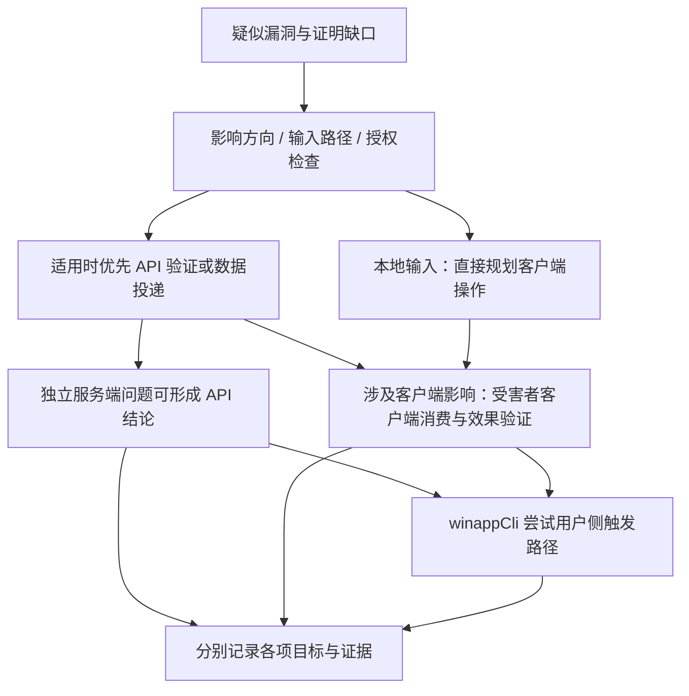

# 客户端与服务端联合动态验证策略

## 1. 适用范围与状态

本策略针对同一产品仓库中的 Windows 客户端与 Java 服务端，依据 2026-09-06 补充的
三类场景修订。它规定后续 Agent 和 Web 平台的验证顺序、证据要求与任务组织方式，
不表示这些联合执行能力已经上线。

当前已有独立 winappCli 控制探针源码；API 执行后端、客户端/服务端联合目标契约、
P08 路由和 Web 调度尚未接通。本次只更新设计，动态验证为 `SKIPPED`。

## 2. 三类场景与优先顺序

| 场景 | 影响方向 | 首选验证方式 | winappCli 的作用 |
| --- | --- | --- | --- |
| 客户端对服务端的影响 | `CLIENT_TO_SERVER` | API 可表达问题时，直接验证服务端校验、身份、权限和资源边界 | API 证据成立后，尝试从客户端真实操作找到同一问题的用户侧触发方式 |
| 服务端或其他客户端对受害者客户端的影响 | `SERVER_TO_CLIENT` / `CLIENT_VIA_SERVER_TO_CLIENT` | 优先用 API 验证可独立成立的服务端问题，或准备客户端消费的数据 | 操作授权受害者客户端接收、打开、同步或渲染数据，观察实际客户端影响；必要时再复现发送方用户入口 |
| 客户端自身缺陷 | `CLIENT_LOCAL` | 按实际输入路径验证，不强制经过 API；服务端输入可沿用上一类的数据准备流程 | 更常用于导入、打开、解析、显示等入口的触发；原生缺陷的判断还需独立诊断证据 |

分类依据是影响方向和输入路径，不只是代码语言。Java 代码中的问题可能影响客户端，
客户端代码中的缺陷也可能通过服务端投递的数据触发。同一 finding 可关联多个场景，
不得仅因验证通道不同就重复计数；若发现新的独立根因，则另建关联 finding。

“API 优先”表示优先用最直接的方法解决当前证明缺口。API 无法表达本地文件、
特定客户端状态或客户端输入事件时，直接安排必要的客户端步骤，不强行走 API，
也不把 API 无法复现记录为“没有漏洞”。

## 3. 验证目标分开记录

每个 finding 至少分别跟踪以下目标，避免把技术成立与产品入口混在一个成功标志里：

- **问题与影响确认**：授权边界或安全性质是否确实被违反，证据对应 claim 的哪部分。
- **数据投递/消费确认**：测试数据是否通过服务端到达指定客户端，以及客户端是否消费。
- **用户侧触发路径确认**：用户可通过哪些界面操作产生或消费相同条件。

服务端越权已由完整 API 对照证据证明，即使客户端没有对应按钮，服务端结论仍然
成立；应保留“客户端入口未找到”的缺口，而不是撤销 API 结论。
相反，如果 claim 是“受害者客户端受到影响”，API 接受数据、返回成功或保存记录
只能证明中间步骤。缺少受害者客户端消费和效果证据时，不得确认完整客户端影响。

客户端界面可能无法构造 API 允许的异常参数。此时应注明“需直接构造请求”，不把
API-only 利用条件包装成普通用户点击即可触发。自行修改客户端控件内部状态、
替换本地响应或直接注入内存也不能自动充当真实用户入口证据。

## 4. 分场景执行流程

### 客户端 → 服务端

1. 从静态发现定位客户端调用点、Java API、身份要求、资源归属与预期安全约束。
2. 在有效授权的 loopback 测试环境中，用最小 API 请求完成基线、测试请求与对照，
   验证服务端实际行为；按需使用不同测试角色，不能仅凭 HTTP 状态码下结论。
3. API 已证明 claim 后，在当前授权允许客户端操作的前提下，用 winappCli 寻找真实
   用户入口，复现同一账号角色、资源和参数关系。
4. 记录客户端动作与 API/服务端结果的关联。未找到入口、UIA 不支持或客户端未授权
   时，保留已成立的 API 证据并独立记录触发路径缺口。

### 服务端 / 其他客户端 → 受害者客户端

1. 明确数据生产方、服务端入口/处理、投递对象，以及受害者客户端的消费位置。
2. 能通过 API 证明服务端独立缺陷时先证明；否则把 API 步骤明确标为数据准备或投递，
   不称为完整漏洞验证成功。
3. 第三方客户端影响场景中，API 使用授权攻击者测试身份提交唯一无害 marker；
   通过服务端的真实业务路径保存/转发，再让受害者测试客户端消费。
4. winappCli 驱动受害者客户端执行实际接收、打开或渲染操作，独立采集 claim 所需的
   影响证据。证明跨用户影响须绑定不同身份、独立状态和正确的投递对象。
5. 若影响已确认，再尝试找到发送方客户端的用户侧提交入口，补全产品操作链。
   此附加入口探索有单独预算，不能无限阻塞已完成的影响结论。

普通 API 调用者不能冒充服务端管理员。若场景依赖服务器配置或响应变化，须单独
绑定授权的本机服务端测试控制能力；缺失时记录缺口，不擅自修改服务或拦截流量。
不同客户端窗口不代表身份隔离；若应用共享账号缓存/profile，不能声称跨用户成功。

### 客户端本地缺陷

1. 从静态证据识别输入来源：本地文件、用户输入、服务端响应或其他客户端数据。
2. 选择与输入来源相符的验证方式。API 对本地输入不适用时，直接规划客户端入口；
   经由服务端的输入则复用投递与消费链。
3. winappCli 负责进入功能、加载授权测试输入并观察界面状态。栈/堆内存缺陷需要
   受限诊断采集器关联异常类型、调用位置、构建/符号信息与测试输入摘要。
4. “无响应”“窗口关闭”“进程退出”或一次崩溃不足以单独证明栈溢出、堆溢出，
   更不能自动推导出可执行任意代码。按证据明确区分观察、诊断与可利用性判断。

原生内存诊断属于后续独立能力，不由 winappCli 本身承担。当前执行边界不允许故意
造成溢出、进程崩溃、资源耗尽或执行攻击代码；相关场景当前只做安全的入口/可达性
观察并记录缺口。本次描述用于规划，不授予破坏性测试权限，也不开放转储采集。
后续诊断方案须限定采集字段，避免完整进程内存中的凭证和个人数据进入证据库。

## 5. Agent 编排与联合证据

同一 finding 的验证计划是一组有依赖的步骤，可以同时引用 API 与 Windows 目标。
不再把 Web/Windows 表单的单选结果当作“整次验证只能用一个工具”的限制。

建议在后续版本化契约中增加：

| 字段 | 含义 |
| --- | --- |
| `impact_directions` | 一个或多个影响方向 |
| `validation_strategy` | `API_FIRST` / `CLIENT_FIRST`；由证明需求决定 |
| `targets` | 已授权 API 服务、发送方/受害者客户端实例及其绑定摘要 |
| `steps` | 每步的 backend、作用、前置依赖、目标引用、身份角色、预算和预期证据 |
| `claim_verification` | claim 及子主张的验证结论与证据引用 |
| `delivery_verification` | 服务端投递与客户端消费的观测状态 |
| `user_trigger_verification` | 用户侧路径的确认结果、操作步骤和适用条件 |

步骤 backend 可为未来的 `api_http`、`windows_uia`，浏览器场景保留
`chrome_devtools`；原生诊断需独立 capability，缺少时不可静默回退。步骤角色可为
`PROVE_CLAIM`、`PREPARE_DATA`、`DELIVER_DATA`、`OBSERVE_CLIENT_EFFECT`、
`REPRODUCE_USER_TRIGGER` 或 `CLEANUP`。

通过 request/finding/source/target digest、唯一 proof ID、测试资源标识、请求与动作
ID 绑定因果链。仅有相近时间戳不能证明某次 UI 操作导致了某次请求或客户端效果。
API 后端采集的 HTTP 证据须携带独立真实来源，不能伪造 `chrome_devtools_mcp` 来源
去通过现有浏览器证据校验器。缺失实际关联证据时明确记录，不从 UI 点击推断请求。

## 6. 授权、分步清理与失败处理

用户可以在任务开始时一次明确授权 API 与客户端两种能力及目标，后续在该范围内
自动编排，不逐步反复询问。API 授权不能自动扩展到任意客户端或第二个测试身份；
缺少能力授权、有效环境或必要登录信息时，相应步骤 `SKIPPED`，继续可完成的静态
和独立验证工作。当前“测试环境信息”开关仍只有既有 Web 快验语义，不能解释成
上述联合授权已经实现。

API 阶段产生的测试数据若被客户端阶段依赖，在有效授权与限定存活时间内保留，
不能 API 返回后立即清理导致后续无法消费。最后一个依赖步骤完成、失败或取消后，
按依赖关系执行客户端缓存/本地测试状态和服务端记录的清理，并分别复核。
客户端步骤无法开展时也要清理已创建的服务端数据；清理失败保留证据、影响范围
和人工处置，不撤销已有有效结论，也不允许自动覆盖残留后重试。

API 确认、客户端消费、用户入口探索各有状态与预算。一个附加步骤失败，不应把
其他已确认子主张改成失败；但缺失 claim 必需的效果证据时，完整 claim 只能保持
证据不足。现有 P08 outcome 枚举和结果禁止覆盖规则继续有效；新步骤状态必须由
版本化契约显式支持，不能直接写入现有 schema。

## 7. Web 平台交互与实施优先级

创建 repo 审计时登记客户端/服务端源码范围及版本对应关系。联合动态验证授权表单
同时配置 localhost API 服务与可选的 Windows 客户端实例，注明测试身份、数据清理
和允许的验证方式。API-only 任务不因缺少 Windows 桌面而失败；涉及客户端效果的
任务则显示尚缺的客户端条件。

完整验证页默认按场景生成计划，展示“API 验证/投递 → 客户端效果 → 用户触发路径”，
允许用户在已有能力范围内选择需要执行的部分。结果分别展示问题成立状态、数据消费
状态和用户入口状态，避免只有一个笼统“验证通过”。同一 finding 的多个步骤汇总到
一个联合结果；新增执行尝试须独立编号并保留既有结果，不能覆写 API 证据。

实施顺序调整为：先完成受限 API 执行后端与独立证据契约，再完成 API/Windows 联合
目标和分步结果契约，接入 Agent 编排与 Web 表单/调度；原生内存诊断后续单独设计。
现有 winappCli 离线 marker 探针不能直接承担联网产品或任意测试输入的联合验证，
需先完成范围、输入、账号、证据与清理能力的扩展。
