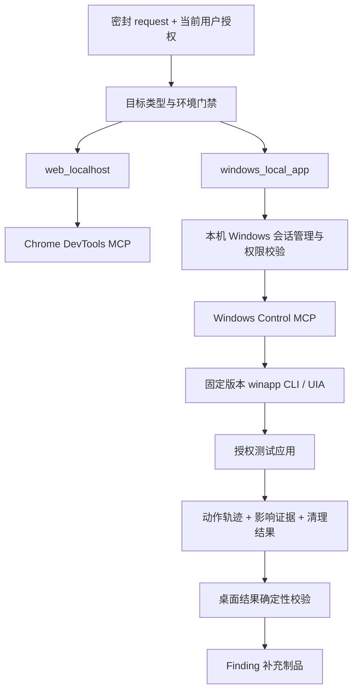

# Windows 动态验证 Agent 接入方案

## 1. 本次交付与目标

本次已完成 `.opencode/skills/dynamic-vulnerability-validator-subagent/winapp-ui-automation/`
的项目适配，更新 `collection.json` 和 `dynamic-vulnerability-validator` 的 Skill 读取
权限。执行工具、P08 契约、漏洞路由、Web Runner 和根目录安全边界均未扩展。
下文除上述 Skill 集成外，均为待实现方案。实际 Windows 动态验证：
`SKIPPED`，原因是本次没有提供或启用授权 Windows 测试环境，且桌面控制器尚未实现。

目标是让文本模型通过 UIA 完成“观察 → 应用输入 → 状态验证 → 清理”，形成可复核
的漏洞补充证据。优先跑通一个标准 Windows 测试程序；视觉模型留作后续可选后端。

设计依据来自用户的[分享讨论](https://chatgpt.com/share/6a9b8bec-aad0-83e9-bada-eb745c4e3843)。
实现参数以微软 [v0.6.0 Skill](https://github.com/microsoft/winappCli/blob/b7494ed3b324d6e378cb17b477f2b1a9729765d0/plugins/winapp/skills/winapp-ui-automation/SKILL.md)
和 [v0.6.0 CLI schema](https://github.com/microsoft/winappCli/blob/b7494ed3b324d6e378cb17b477f2b1a9729765d0/docs/cli-schema.json)
为准。2026-09-05 查询时最新公开 release 为 v0.6.0；开发分支 schema 已为 0.6.3。
固定来源提交 `b7494ed3b324d6e378cb17b477f2b1a9729765d0`，不使用浮动 main 安装。

## 2. 当前实现与推荐架构

当前 Agent 的 `bash` 仅允许固定结果校验脚本，`chrome-devtools_*` 是唯一执行后端。
`validation-runner.mjs` 强制 loopback HTTP(S) URL、Web 漏洞 capability 和 Browser
Session Broker。因此“安装 skill”不会让现有完整验证流程自动操作 EXE。

建议保留 `dynamic-vulnerability-validator` 作为完整验证入口，通过目标类型选择
后端，避免新增一套重复的 Finding/审计流程。现阶段不增加子 Agent：

分两步落地：先实现固定 Node CLI 适配器验证 UIA 调用和作用域，再以 stdio MCP 暴露
同一适配器。两种入口共享校验器，不能出现一个检查严格、另一个允许任意 shell 的路径。
最终 Agent 调 MCP；保留固定 Node 结果校验命令，不开放 `winapp *` 或任意 PowerShell。

浏览器任务继续走 Chrome DevTools MCP。Electron/WebView2 首期只验证已绑定桌面
窗口中的 UI 流程；需要 HTTP/XSS 证据时必须另走已授权 loopback Web 路由，不能把
UIA 点击、显示字符串或截图当成浏览器执行证据。

## 3. 授权与目标契约

实施桌面执行前，需要显式修订根 `AGENTS.md` 的“仅 loopback Web / Chrome DevTools”
边界，增加本机 Windows 测试进程这一目标类型。通过正式配置和确定性校验落地，
不能只修改 Agent prompt 绕过当前规则。网络目标仍仅允许 `localhost`、`127.0.0.1`、
`[::1]`，不增加远程 Windows worker、UNC 路径、远程 staging 或真实账号。

新增版本化、带类型判别的 `WINDOWS_LOCAL_APP_TARGET`；不要把 EXE 填进 `base_url`，
也不要构造假的 localhost URL 去通过 Web 校验器。建议绑定以下字段：

| 字段组 | 内容与校验 |
| --- | --- |
| 公共绑定 | request ID/digest、audit ID、finding ID/digest、source commit、scope digest |
| 用户授权 | 明确 opt-in、授权测试环境标志、授权时间及来源摘要；不是仅由 request 推断 |
| 宿主机 | `platform=win32`、本机 worker ID、Windows session ID、测试身份角色 |
| 应用身份 | 服务端注册的 app ID、规范化本地 EXE 路径、SHA-256、固定启动参数摘要 |
| 运行身份 | PID + 创建时间 + HWND + 窗口 owner 链；只由控制器观测填入 |
| 数据范围 | 授权测试目录与允许的应用内记录；禁止 UNC、路径穿越和 reparse-point 逃逸 |
| 网络范围 | 无网络或明确列出的 loopback origin；不继承系统代理/远程后端授权 |
| 证明与清理 | 允许动作、预期观察、账号角色、清理路径、时间/步骤上限 |
| 工具绑定 | winapp 版本、可执行文件摘要、CLI schema 摘要、适配器版本 |

持久化目标绑定只保存无凭证的规范化授权快照；运行时秘密保留在受限临时通道。
创建应用与附加应用是不同授权：首期只附加用户准备好的专用测试实例；后续启动能力
只允许平台注册的程序和固定参数，不根据模型输出下载、构建或执行任意 EXE。

授权关闭、环境无效或必需账号/登录信息缺失时，在调度层记录 `SKIPPED`，不启动
控制器或附加应用。执行开始后的 UI 能力缺失是 `INCONCLUSIVE`/`NOT_RUN`；基础设施
中断可标记运行状态 `BLOCKED`。必须区分调度状态与结果契约 outcome，不能把
`SKIPPED`/`BLOCKED` 塞入只允许四种 outcome 的既有结果 schema。

## 4. Windows Control MCP 接口

以下接口名均为拟新增能力，不是 winapp 已有 MCP。控制器以 argv 数组、`shell: false`
调用绝对路径 winapp.exe，校验结构化输入，限制超时/输出体积，并在脱敏后才发事件。

| 拟新增工具 | 底层实现 | 约束 |
| --- | --- | --- |
| `windows-control_inspect` | `ui inspect --json` | 必须指定服务端会话；限制深度、节点数与字段 |
| `windows-control_search` | `ui search --json` | 只在登记 HWND；返回当前 selector |
| `windows-control_invoke` | `ui invoke --json` | 单一控件；执行前重查进程和窗口归属 |
| `windows-control_set_value` | `ui set-value --json` | 仅测试字段、非敏感值；绑定长度和字符约束 |
| `windows-control_get_state` | `ui get-value/get-property` | 属性白名单，屏蔽密码/敏感控件 |
| `windows-control_wait_for` | `ui wait-for --json` | 有界等待，不能无限轮询 |
| `windows-control_screenshot` | `ui screenshot` | 控件/窗口范围，输出路径由服务端生成 |
| `windows-control_cleanup` | 已登记应用内动作 | 不提供任意文件/进程删除入口 |

窗口枚举和会话分配属于控制器内部能力，不向模型提供整机 `list-apps`。
模型只能传会话 ID 与观测到的 selector，不能传任意 EXE、PID、HWND、输出路径或
shell 命令。租约绑定 request/target digest，防止会话 ID 跨任务复用。

MVP 不开放坐标点击、触摸、笔、录像、任意键盘输入、文件/注册表写入和网络抓包。
后续若需要键盘输入，必须单独能力开关、独占桌面、前台窗口校验、限定快捷键，
并采用 `--verbatim` 处理普通文本。CLI 命令行会暴露输入，不可用来传凭证。

## 5. Agent 工作流与漏洞证据

1. 校验 P08 INPUT 与 request/source/target 摘要，按目标类型加载操作 Skill 及未来
   `windows-runtime-validation` 证据 Skill。目录中的语言标签不能代替桌面能力声明。
2. 控制器分配专用测试桌面租约，核实进程归属和版本；获取最小 baseline。
3. 可选无副作用控制探针，记录 `CONTROL_PROBE_ONLY`，不得支持漏洞确认。
4. 通过真实应用控件提交唯一、无破坏性输入，记录动作前后控件状态与实际响应。
5. 根据 claim 验证影响；涉及持久状态时重访。操作失败先检查是否已产生副作用，
   不盲重试保存、提交或删除。设置整体超时与最大步骤数，防止失控循环。
6. 使用应用内授权路径清理，重访检查。失败保留残留范围和人工处置，不抹除有效证据。
7. 校验器封存结果并返回 OUTPUT；不自动修改静态 Finding、裁决或最终报告。

桌面 UIA 的证据能力与漏洞证据能力分开判断：

| 主张 | 足够的观察方向 | 仅有 UIA 时的限制 |
| --- | --- | --- |
| 应用工作流/权限边界 | 两个授权角色的对照、相同测试记录与实际操作结果 | 两个窗口不等于两个身份；共享进程/profile 不能证明跨用户 |
| 文件行为 | 应用真实产生的测试文件，受限采集器读取授权目录中的路径/大小/hash | 文件对话框显示路径不是文件已创建；不得破坏性覆盖验证 |
| 网络或嵌入式 Web 问题 | 已授权 loopback 网络证据及对应请求绑定 | winapp 没有 CDP 网络证据；缺采集器时保留缺口 |
| 进程执行/提权/崩溃 | 首期只检查安全的可达性或边界行为 | 不执行命令注入、提权、崩溃或资源耗尽型确认 |

专用测试应用应无外部服务依赖。仅把允许 origin 写进 JSON 不能阻止 EXE 自己联网；
需由测试环境提供可验证的出站限制，或使用可确认的离线 fixture。Agent 不得临时
修改整机防火墙去声称已经隔离，也不能根据“没有抓到包”断言未发生外联。

## 6. 结果契约与改动清单

复用公共 result 的 request/finding/scope digest、四种 outcome、observations、
counterevidence、residual_gaps 和 safety attestation，新增桌面扩展：

- `windows_runtime_extension_schema_version`、`environment_binding_digest`。
- `desktop_backend`：winapp/UIA、实际版本、程序摘要、适配器版本、租约/session ID。
- `action_trace`：递增序号、动作 ID、目标绑定、selector、前后状态证据引用、时间、
  退出码/结构化错误；所有证据引用带相对路径、内容摘要和脱敏标志。
- `desktop_verification`：`CONTROL_PROBE_ONLY`、`APP_STATE_OBSERVED`、
  `CLAIM_EFFECT_CONFIRMED`、`CROSS_IDENTITY_CONFIRMED`、`NOT_CONFIRMED`（拟定分级）。
- `cleanup`：尝试、结果、复核、残留测试对象和人工处置。

`SUPPORTED_RUNTIME` 必须有 claim 对应的因果证据链；控件观察或截图不能单独通过。
桌面校验器不可复用 Web-XSS 的特殊等级；公共契约校验通过后仍须通过桌面扩展校验。
相同静态 finding 的 Web/桌面尝试共享现有禁止覆盖规则，后续多 attempt 需独立版本化。

| 接入点 | 后续改动 |
| --- | --- |
| `AGENTS.md` | 按目标类型正式增加本机 Windows 测试执行边界 |
| `.opencode/agents/dynamic-vulnerability-validator.md` | 目标分派、桌面结果校验、最小工具权限 |
| `.opencode/skills/.../windows-runtime-validation/`（新增） | target/result schema、证据规则及校验脚本 |
| `.opencode/scripts/windows-control-core.mjs`（新增） | 版本探测、argv、作用域/脱敏、状态解析 |
| `.opencode/scripts/windows-control-mcp.mjs`（新增） | stdio 工具层，不启动公共网络服务 |
| `.opencode/opencode.json.bak` 及生成配置 | 默认关闭 Windows MCP；仅本次授权任务注入 |
| `.opencode/agent-manifest/{roles,skill-map,mcp-map,artifact-policy}.json` | 同步职责、技能、工具与桌面制品类型 |
| P08 `stage-agent-contracts.json` 及校验代码 | 版本化目标联合类型；旧 Web INPUT/OUTPUT 保持兼容 |
| 漏洞 capability registry（新增） | 按 `target_kind + vulnerability_type_id + proof_method` 白名单路由 |

`quick-dynamic-validator` 的 120 秒 Web 快验本期不扩展桌面，避免审计 opt-in 意外
获得整机桌面控制能力。完整桌面验证仍是用户显式发起的旁路流程。

## 7. 验收顺序

先在受支持 Windows/Linux 原生宿主机完成纯静态/模拟回归：权限默认 deny、缺失授权
SKIPPED、版本不兼容拒绝、PID/HWND 复用、跨进程窗口、越界路径、超时、脱敏、摘要
漂移、错误 outcome 和旧 Web 契约兼容。模拟测试不得启动应用或浏览器。

用户另行启用并提供本机 Windows fixture 后，再做真实冒烟：inspect → 写入无害
marker → 应用提交 → wait/get-state → 清理；加入 UIA 控件过期、窗口退出、锁屏、
清理失败的场景。冒烟成功仅说明桌面自动化可用；还需有明确安全漏洞与安全对照的
测试 fixture，才能验证 `SUPPORTED_RUNTIME` 的判定链。首期不测试破坏性漏洞。

Web 平台、部署和交互设计见 [Windows 动态验证平台接入方案](windows-dynamic-validation-platform-design.md)。
