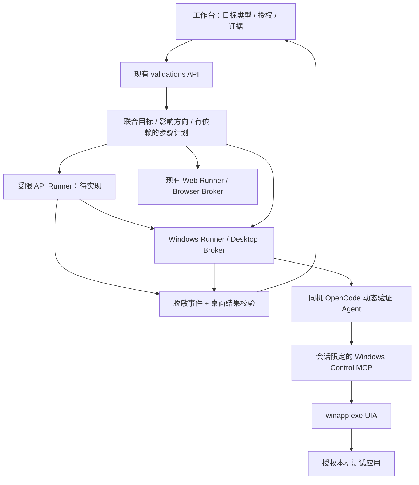

# Windows 动态验证 Web 平台接入方案

## 1. 定位与实施顺序

本文件的 Web 平台接入仍为待实现设计；`dev` 已实现独立 winappCli CLI/默认关闭的
stdio MCP 与模拟用例，见 [控制层第一阶段](winapp-control-poc.md)。尚未增加 Web 表单、
API 或 Windows Runner。动态验证为 `SKIPPED`，没有启动浏览器、EXE 或目标环境。
Agent 权限与证据规则以 [Agent 接入方案](windows-dynamic-validation-agent-design.md) 为准。
产品级场景、API 优先顺序与分步结果采用
[客户端与服务端联合动态验证策略](client-server-dynamic-validation-strategy.md)，以下为接入细节。

建议首个可用版本把工作台、OpenCode、Windows 控制器和目标测试程序部署在同一台
Windows 原生宿主机。Web 页面负责提交任务、展示状态和证据，真正的 UIA 操作由
Windows 进程执行；浏览器自身不能直接控制 EXE。

Linux 原生平台继续运行已有 Web 能力，显示“当前主机不支持 Windows 桌面执行”，
保留读取桌面结果的能力。不引入远程 Windows worker、容器、Wine 或虚拟显示回退。
当前 macOS 工作区只完成文件集成和文档/配置静态检查；不声称已通过 Windows 运行验收。

## 2. 架构与职责



推荐从 `DynamicValidationRunner` 中分离目标相关操作为 backend adapter，复用其
运行记录、幂等键、事件、取消与临时授权清理。每个 backend 提供
`authorize / validateArtifacts / acquireSession / buildPrompt / runtimeConfig /
validateResult / releaseSession`，不要在每个函数中不断增加 Windows 条件分支。

保留 `BrowserSessionBroker`；新增独立 `WindowsDesktopSessionBroker`。Windows
桌面没有浏览器 tab/context 隔离语义，不把 `browser_mode` 重命名后直接复用。

## 3. 工作台使用流程

1. 在“完整动态验证”选择已密封请求，按影响方向生成 API 优先或客户端优先的计划。
   一个联合任务可同时配置 localhost API 服务和 Windows 客户端；浏览器 Web 验证
   保留独立后端。不支持的步骤显示缺口，不阻止其他独立且已授权的步骤。
2. Windows 表单从本机管理员预登记的测试应用中选择，展示程序名称、版本/hash、
   专用测试实例和桌面就绪状态。前端不能提交任意可执行路径、启动参数或 shell。
3. 用户选择已授权测试身份模式并填写必要的操作/清理说明，明确启用本次桌面验证。
   未启用、环境无效或必需登录信息缺失时记录 SKIPPED，静态工作继续。
4. 服务端执行预检，获取独占桌面租约后运行。页面显示“排队、准备、验证、清理、完成”
   的中文状态及具体失败原因。排队时不给 OpenCode 注入 Windows 执行工具。
5. 详情页展示控件动作时间线、脱敏前后状态、必要截图、证据等级、缺口和清理残留。
   保留“取消”按钮；取消新动作后仍须走有界清理，不等同于立即强杀目标进程。

联合表单将 API 服务和 Windows 实例并列配置，而不是用 EXE 替换 URL。每种后端
独立授权，客户端可区分发送方与受害者身份；API-only 任务无需 Windows 桌面。
浏览器模式仅用于实际浏览器步骤。Windows 先只支持预登录的专用测试会话或匿名 fixture。
未来有秘密输入 broker 后再支持平台代登录，禁止将密码写进 winapp argv。

页面不提供任意桌面遥控、终端、鼠标坐标或键盘自由输入框。模型的行动由受管 MCP
执行；工作台展示只读证据，不把 UIA 原始值当 HTML 渲染。

## 4. API 与数据模型

复用现有 `POST /api/v1/validations`、`POST /api/v1/validations/:id/actions`
和 `GET /api/v1/validations/:id/events`，新增带类型判别的请求版本。
以下是单 Windows 子目标的早期表单草案，尚不能发送给当前服务器。产品联合任务
需按联合策略另行定义包含 `targets`、`steps` 与分后端授权的版本化 schema；不能把
这份单目标草案直接用于跨客户端/服务端任务：

```json
{
  "schema_version": 2,
  "validation_request_id": "audit-test::finding-test",
  "repository_id": "repo-test",
  "target_kind": "windows_local_app",
  "explicit_authorization": true,
  "test_environment": true,
  "windows_target": {
    "registered_app_id": "fixture-desktop",
    "registered_instance_id": "fixture-instance-1",
    "session_mode": "exclusive_test_desktop",
    "account_mode": "anonymous"
  },
  "cleanup_instructions": "通过测试应用内的清除测试数据功能移除本次 marker。"
}
```

程序路径/hash、PID/创建时间、HWND、Windows session ID 和 capability 由服务端
注册表与控制器解析填入密封 target binding，不信任客户端声称的绑定。提交时的
app/version 指纹与执行时的文件摘要不符则拒绝，不自动接受更新后的 EXE。

旧请求缺少 `target_kind` 时仅按既有 `web_localhost` 解释，继续使用原 URL 校验。
不识别的 target kind、字段混用、未经授权的实例或不支持的 schema version 均拒绝。
不能在失败后擅自切换到未授权目标。API→Windows 的后续步骤应由最初已授权的联合
计划和依赖关系明确安排；可选的用户入口探索失败不撤销已有 API 结论。

建议新增只读能力接口 `GET /api/v1/desktop-capabilities`，返回平台支持、已注册应用
的脱敏信息、可用 proof methods 和可读的不可用原因。普通健康检查只检查安装/配置；
不得自动枚举桌面、截图或附加程序。目标特定预检只在有效授权任务内进行。

运行记录增加 `target_kind`、`desktop_session_id`、`desktop_backend`、`app_digest`、
`proof_method` 和 `cleanup`。公共幂等机制应绑定规范化请求摘要；相同 key 对应不同
目标或 request digest 返回冲突。重复点击返回原任务，不重复触发应用提交。

保留 request/source commit 校验、仓库隔离、同 finding 禁止并发、已有结果禁止覆盖、
路径范围和符号链接检查。Windows 还需测试盘符大小写、UNC、junction/reparse point、
短路径、备用数据流和路径规范化，不能只沿用 POSIX 字符串比较。

## 5. Windows 会话、并发与取消

桌面租约键至少为 `host_id + windows_session_id + desktop_id`。首期每个测试桌面
最多一个动态任务，连 UIA-only 任务也串行，防止模态对话框、焦点和共享数据互相影响。
跨进程/多窗口不代表隔离；附加实例的所有允许窗口必须登记到同一租约。

控制器运行在专用测试用户的交互会话内。不要把 Session 0 后台服务当作可操作用户
桌面的 executor。首期不提供自动解锁、RDP 登录、凭证保存或提权；无法确认桌面
就绪时返回 BLOCKED，待环境恢复后通过新一轮显式操作重试。

建议状态机：

```text
授权/环境不满足 → skipped
授权与契约有效 → queued → preparing → running → cleaning → completed
执行故障 → cleaning → failed / blocked
用户取消 → cancelling → cleaning → cancelled
```

其中 `completed` 仅表示已产生并校验结果，不等于漏洞确认；结果仍可为 INCONCLUSIVE。
授权缺失在创建任何会话之前处理。服务端 API 的非法请求可以返回 4xx，但静态调度
汇总仍要记录 SKIPPED 与原因，不能阻断静态报告。

取消时撤销新动作权限，等待/中止本任务 CLI 调用，再进行已登记应用内清理。适配器
超时处理只针对其创建的 CLI 子进程；首期目标应用为附加实例，不强杀。已创建的应用
以后也必须有精确 PID+创建时间所有权记录，并优先通过应用正常退出。任何路径都
不允许全局终止 Chrome/Chromium 或按进程名批量结束应用。

进程崩溃或平台重启后，过期租约进入待恢复状态；重新校验实例和残留后才释放。
不自动恢复上次未完成的提交/删除操作。跨账号证明若应用共享 profile/进程状态无法
隔离，则返回缺口；先不承诺同一 Windows 桌面可完成所有双身份场景。

## 6. 证据展示与持久化

复用 `reports/validation-handoff/runtime/<audit_id>/` 的补充制品布局，使用独立桌面
target/result schema。详情模型按 `target_kind` 分派，旧 Web 数据保持可读。

桌面详情页建议包含：

- 环境卡：测试应用、版本/hash、实际 winapp 版本、会话模式、绑定摘要与运行状态。
- 动作时间线：序号、操作含义、selector、前后状态、耗时、错误/警告和证据引用。
- 证据面板：最小化 UIA 子树、控件/窗口截图、受限影响采集器产物。
- 结论面板：问题成立、数据投递/消费、用户触发路径分别展示；保留探针等级、反证、
  残留缺口、分阶段清理结果和人工处置。API 投递成功不能显示为客户端漏洞确认。

MCP 输出、stdout/stderr、OpenCode 工具事件与 SSE 必须在落盘和广播之前脱敏。
当前日志中的通用字符串替换不能直接作为 Windows 截图/控件树脱敏实现。密码控件
禁止读取；图片只采集无敏感值的测试区域，无法可靠处理时不持久化并显示缺口。
不直接信任 Agent 写的 `sanitized=true`：校验器需验证采集器来源、字段白名单、路径
和 digest；不能安全脱敏的产物拒绝进入证据库。

新增的图片读取接口必须沿用仓库/任务作用域检查、限定 MIME 与大小、拒绝越界路径，
只返回已验证的证据清单条目。UIA 字符串使用 textContent，下载文件使用受控文件名。
不把桌面动作硬塞进 `HTTP_EXCHANGE_V2`，也不生成虚假的 HAR。Chrome 采集的 Web
证据保留现有契约；直接 API 后端需独立且真实的来源标识和 HTTP 证据契约。联合导出
以 proof ID、请求/动作 ID 和测试资源关联两路证据，不能伪造浏览器来源。

## 7. 具体接入位置

以下相对路径以 `.opencode/web/dynamic-validation-observatory/` 为基准：

| 当前文件 | 后续接入 |
| --- | --- |
| `validation-runner.mjs` | 提取 backend adapter，并增加有依赖的联合步骤编排与结果汇总 |
| API backend 与联合计划契约（新增） | 受限 HTTP 执行、独立来源证据、API/桌面目标引用、分步授权和清理 |
| `dynamic-validation-core.mjs` | 保留 Web URL 和浏览器策略；桌面规则放新模块，避免放宽 loopback 函数 |
| `web-validation-policy.mjs` | 保持 Web 职责；新增上层类型路由和 `windows-validation-policy.mjs` |
| `windows-desktop-session-broker.mjs`（新增） | 桌面独占租约、任务窗口登记、取消/恢复 |
| `server.mjs` | 表单 schema 分派、能力 API、桌面证据读取；保留现有安全 Header/Origin 检查 |
| `manual-validation-request-materializer.mjs` | request 增加明确目标/证明适配，保持来源和 scope 封存 |
| `model.mjs` / `workspace-model.mjs` | 按目标类型聚合、校验、脱敏并呈现 sidecar |
| `opencode-runtime-config.mjs` 及 Runner runtime config | 只为授权桌面任务注入 Windows MCP；桌面任务不创建 Chrome 会话 |
| `environment-health.mjs` | 无副作用的可执行文件/版本/配置探测，Windows 能力分项展示 |
| `public/index.html` / `public/app.js` / `public/styles.css` | 目标表单分支、状态和桌面证据页 |
| `.opencode/scripts/dynamic-validation-cli.mjs` | 复用同一 backend 门禁，CLI 不成为绕过 Web 授权的入口 |
| `docs/installation.md` / Windows 安装入口 | 固定发布版本和原生路径探测；不自动安装整个 SDK/证书链 |

## 8. 分阶段验收

按补充场景，B/C 阶段先补 API 后端和联合目标/结果契约，再接 Agent 与平台调度。
原生内存诊断独立设计，当前不执行故意崩溃或内存破坏测试。

| 阶段 | 交付 | 通过条件 |
| --- | --- | --- |
| 已完成：Skill | 中文适配、许可证、来源摘要、集合和读取权限 | 静态一致性与引用核对；执行权限仍未开放 |
| A：原生控制 PoC（源码已实现，原生验收待运行） | argv 适配器、版本门禁、窗口绑定、fixture 动作链 | 授权 Windows 环境中稳定完成安全 marker 的输入/读取/清理 |
| B：Agent 接入 | Windows MCP、目标/结果契约、P08 路由 | 不支持的操作拒绝；探针不能确认漏洞；完整影响证据可封存 |
| C：平台接入 | 表单/API、会话队列、SSE、证据视图、取消 | 端到端任务可复核；并发隔离、残留清理和旧 Web 流程通过回归 |
| D：按需增强 | 受限文件/注册表/网络观察，独立视觉 backend | 每项新增能力都有独立范围约束和证据验收；不自动回退 |

默认模拟回归覆盖：Windows/Linux 能力差异、未授权零进程启动、缺登录信息跳过、
篡改 app/instance、未知目标类型、版本/schema 不兼容、窗口归属变化、双任务争抢
桌面、重复提交、取消中清理、重启后的租约恢复、跨仓库读取与截图脱敏。

联合模拟验收还需覆盖：API 确认但无客户端入口、API 投递成功但客户端无效果、
缺少受害者身份、客户端本地输入无需 API、依赖数据在最后消费前不被清理，以及
客户端阶段失败/取消后服务端数据仍需清理。以上均不能靠统一的“成功”标志代替。

真实 E2E 仅在用户显式启用并提供授权 Windows fixture 后执行，动态测试不能成为
默认 `npm test` 的隐式副作用。Windows/Linux 上完成相应宿主机回归；Linux 不尝试
启动 Windows 应用。当前控制层源码交付不等于上述 A—D 阶段已通过验收。
